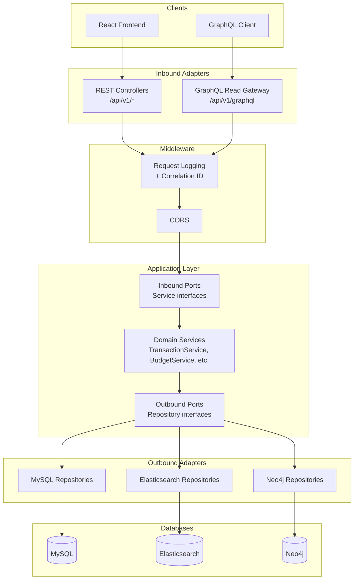
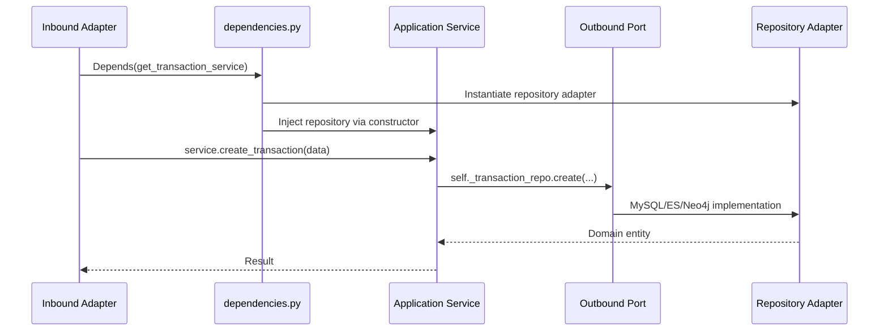

# Finance Tracker -- Multi-Database Personal Finance Application

A personal finance tracking application built with **hexagonal architecture (ports & adapters)**, **CQRS**, and **multi-database support** across MySQL, Elasticsearch, and Neo4j. The backend uses FastAPI with domain-driven bounded contexts, and the frontend is a React SPA.

## Table of Contents

- [Quick Start](#quick-start)
- [Architecture](#architecture)
- [Project Structure](#project-structure)
- [API Reference](#api-reference)
- [GraphQL Read Gateway](#graphql-read-gateway)
- [Configuration](#configuration)
- [Testing](#testing)
- [Database Support](#database-support)
- [Security](#security)
- [Development](#development)
- [Documentation](#documentation)

---

## Quick Start

### Prerequisites

- Python 3.11+
- `uv` (Python package manager)
- Node.js 18+ (for frontend)
- Docker Desktop (optional, for database services)

### Backend

```bash
cd backend
uv sync
uv run uvicorn backend.main:app --reload --port 8000
```

- API docs: http://localhost:8000/docs
- Health check: http://localhost:8000/health
- GraphQL playground: http://localhost:8000/api/v1/graphql

### Frontend

```bash
cd frontend/finans-tracker-frontend
npm install
npm start
```

- App: http://localhost:3000

### Docker (all services)

```bash
docker-compose up -d
```

See [INSTALLATION.md](INSTALLATION.md) for detailed setup including database seeding.

---

## Architecture

### Hexagonal Architecture with CQRS

The backend is organized into bounded contexts, each following hexagonal architecture:

- **REST** handles commands (create, update, delete) via inbound adapters
- **GraphQL** handles cross-domain read queries via a read gateway adapter
- Application services enforce business rules and are injected with outbound port implementations
- Outbound adapters implement repository interfaces for MySQL, Elasticsearch, and Neo4j



### CQRS Split

| Operation | Protocol | Example |
|-----------|----------|---------|
| Commands (write) | REST | `POST /api/v1/transactions/` |
| Queries (read) | GraphQL | `query { financialOverview { ... } }` |
| Domain-specific reads | REST | `GET /api/v1/transactions/` |

The GraphQL endpoint is a cross-domain read gateway that aggregates data from multiple bounded contexts (analytics, transactions, categories) through a single query interface, without breaking domain encapsulation.

### Dependency Injection Flow



### Observability

Every HTTP request gets a correlation ID (auto-generated UUID or forwarded from `X-Correlation-ID` header). The ID is included in log output and returned in the `X-Correlation-ID` response header for end-to-end tracing.

- Development: human-readable log format
- Production: structured JSON logs with `correlation_id`, `method`, `path`, `status`, `duration_ms`

---

## Project Structure

```
finance-tracker/
├── backend/
│   ├── main.py                 # FastAPI app, middleware, router registration
│   ├── config.py               # Environment variable configuration
│   ├── auth.py                 # JWT authentication + bcrypt hashing
│   ├── dependencies.py         # FastAPI DI wiring (service factories)
│   │
│   ├── transaction/            # Bounded context: transactions
│   │   ├── adapters/
│   │   │   ├── inbound/        # REST API (rest_api.py)
│   │   │   └── outbound/       # MySQL repository, category adapter
│   │   ├── application/
│   │   │   ├── ports/          # Inbound + outbound interfaces
│   │   │   ├── service.py      # Application service
│   │   │   └── dto.py          # Data transfer objects
│   │   └── domain/
│   │       ├── entities.py     # Domain entities
│   │       └── exceptions.py   # Domain exceptions
│   │
│   ├── budget/                 # Bounded context: budgets (same layout)
│   ├── category/               # Bounded context: categories
│   ├── account/                # Bounded context: accounts + groups
│   ├── goal/                   # Bounded context: goals
│   ├── user/                   # Bounded context: users + auth
│   ├── analytics/              # Bounded context: dashboard + GraphQL gateway
│   │   └── adapters/inbound/
│   │       └── graphql_api.py  # Cross-domain GraphQL read gateway
│   │
│   ├── database/               # Database connection managers
│   │   ├── mysql.py            # SQLAlchemy engine + session
│   │   ├── elasticsearch.py    # ES client
│   │   └── neo4j.py            # Neo4j driver
│   │
│   ├── models/mysql/           # SQLAlchemy ORM models
│   ├── repositories/           # Legacy repository layer (multi-DB factory)
│   │   ├── base.py             # Abstract interfaces (ABC)
│   │   ├── mysql/              # MySQL implementations
│   │   ├── elasticsearch/      # Elasticsearch implementations
│   │   └── neo4j/              # Neo4j implementations
│   │
│   ├── shared/
│   │   ├── schemas/            # Pydantic validation schemas
│   │   └── exceptions/         # Business exception classes
│   │
│   └── tests/
│       ├── unittests/
│       │   ├── services/       # Service layer unit tests
│       │   └── test_*.py       # Schema BVA validation tests
│       └── integration/
│           ├── conftest.py     # Shared fixtures, auth helpers
│           ├── test_graphql_flow.py
│           ├── test_transaction_flow.py
│           ├── test_budget_flow.py
│           ├── test_account_flow.py
│           ├── test_goal_flow.py
│           └── test_analytics_flow.py
│
├── frontend/
│   └── finans-tracker-frontend/  # React SPA
│       ├── src/
│       │   ├── components/     # UI components
│       │   ├── pages/          # Page components
│       │   ├── context/        # Auth context
│       │   ├── hooks/          # Custom hooks
│       │   └── utils/          # API client
│       └── cypress/            # E2E tests
│
├── docker-compose.yml
├── Dockerfile
├── example.env
├── INSTALLATION.md
└── README.md
```

---

## API Reference

All domain routes are versioned under `/api/v1/`. Root-level endpoints (`/`, `/health`) are not versioned.

### Router Map

| Path | Domain | Protocol | Auth |
|------|--------|----------|------|
| `/api/v1/transactions/*` | Transaction | REST | Yes |
| `/api/v1/transactions/upload-csv/` | Transaction | REST | Yes |
| `/api/v1/planned-transactions/*` | Transaction | REST | Yes |
| `/api/v1/categories/*` | Category | REST | Partial |
| `/api/v1/budgets/*` | Budget | REST | Yes |
| `/api/v1/budgets/summary` | Analytics | REST | Yes |
| `/api/v1/dashboard/overview/` | Analytics | REST | Yes |
| `/api/v1/dashboard/expenses-by-month/` | Analytics | REST | Yes |
| `/api/v1/accounts/*` | Account | REST | Yes |
| `/api/v1/account-groups/*` | Account | REST | No |
| `/api/v1/goals/*` | Goal | REST | Yes |
| `/api/v1/users/*` | User | REST | Partial |
| `/api/v1/graphql` | Analytics (read gateway) | GraphQL | Yes |

### Authentication

All protected endpoints require:
- `Authorization: Bearer <jwt-token>` header
- `X-Account-ID: <id>` header (optional, defaults to user's first account)

### Key Endpoints

```bash
# Register
curl -X POST http://localhost:8000/api/v1/users/ \
  -H "Content-Type: application/json" \
  -d '{"username": "testuser", "email": "test@example.com", "password": "test123456"}'

# Login
curl -X POST http://localhost:8000/api/v1/users/login \
  -H "Content-Type: application/json" \
  -d '{"username_or_email": "testuser", "password": "test123456"}'

# Create transaction (with JWT token)
curl -X POST http://localhost:8000/api/v1/transactions/ \
  -H "Content-Type: application/json" \
  -H "Authorization: Bearer YOUR_TOKEN" \
  -H "X-Account-ID: 1" \
  -d '{"amount": -100.50, "description": "Groceries", "date": "2025-12-09", "type": "expense", "Category_idCategory": 1}'
```

---

## GraphQL Read Gateway

The GraphQL endpoint at `/api/v1/graphql` provides read-only queries across multiple bounded contexts. No mutations are exposed -- all write operations use REST.

### Available Queries

| Query | Description | Returns |
|-------|-------------|---------|
| `financialOverview(accountId)` | Income, expenses, balance, transaction count | `FinancialOverviewType` |
| `expensesByMonth(accountId)` | Monthly expense breakdown | `[MonthlyExpenseType]` |
| `budgetSummary(accountId, month, year)` | Budget vs actual spending per category | `[BudgetSummaryEntryType]` |
| `categories` | All categories | `[CategoryType]` |
| `transactions(accountId)` | Transactions for an account | `[TransactionType]` |

### Example Query

```graphql
query {
  financialOverview(accountId: 1) {
    totalIncome
    totalExpenses
    balance
    transactionCount
  }
  categories {
    id
    name
    type
  }
}
```

---

## Configuration

All configuration is loaded from environment variables via `backend/config.py`. See `example.env` for the full list with descriptions.

### Core Variables

| Variable | Required | Default | Description |
|----------|----------|---------|-------------|
| `SECRET_KEY` | Yes | -- | JWT signing key |
| `DATABASE_URL` | Yes | -- | MySQL connection string |
| `ACTIVE_DB` | No | `mysql` | Global fallback database |
| `TRANSACTIONS_DB` | No | `mysql` | Database for transaction workloads |
| `ANALYTICS_DB` | No | `ACTIVE_DB` | Database for analytics workloads |
| `USER_DB` | No | `mysql` | Database for user workloads |
| `CORS_ORIGINS` | No | `http://localhost:3000,http://localhost:3001` | Allowed origins |
| `ENVIRONMENT` | No | `development` | `development`, `staging`, `production` |
| `LOG_LEVEL` | No | `INFO` | `DEBUG`, `INFO`, `WARNING`, `ERROR`, `CRITICAL` |
| `ELASTICSEARCH_HOST` | No | `http://localhost:9200` | Elasticsearch URL |
| `NEO4J_URI` | No | `bolt://localhost:7687` | Neo4j bolt URI |
| `NEO4J_USER` | No | `neo4j` | Neo4j username |
| `NEO4J_PASSWORD` | No | -- | Neo4j password |

---

## Testing

The project has **239 tests** organized following the testing pyramid:

```
     +----------+
     |   E2E    |   Cypress (frontend)
     +----------+
     | Integr.  |   45 tests - Full HTTP flow + GraphQL
     +----------+
     |   Unit   |   194 tests - Business logic + schema BVA
     +----------+
```

### Running Tests

```bash
cd backend

# All tests
uv run pytest tests/ -v

# Unit tests only
uv run pytest tests/unittests/ -v

# Integration tests only
uv run pytest tests/integration/ -v

# With coverage
uv run pytest tests/ --cov=backend --cov-report=html
```

### Test Categories

| Category | Location | Count | What It Tests |
|----------|----------|-------|---------------|
| Service unit tests | `tests/unittests/services/` | ~30 | Service layer with mocked repos |
| Schema BVA tests | `tests/unittests/test_*.py` | ~164 | Pydantic schema boundary values |
| Integration tests | `tests/integration/` | 45 | Full HTTP stack with in-memory SQLite |
| GraphQL tests | `tests/integration/test_graphql_flow.py` | 13 | GraphQL queries, schema validation, correlation ID |

---

## Database Support

The application supports three databases. Each bounded context can independently select its database via environment variables (`TRANSACTIONS_DB`, `ANALYTICS_DB`, `USER_DB`).

### Database Selection

```bash
# Use MySQL for everything (default)
ACTIVE_DB=mysql

# Use Elasticsearch for analytics, MySQL for the rest
ANALYTICS_DB=elasticsearch

# Use Neo4j for analytics
ANALYTICS_DB=neo4j
```

### Comparison

| Feature | MySQL | Elasticsearch | Neo4j |
|---------|-------|---------------|-------|
| Primary use | CRUD operations | Search & analytics | Graph queries |
| Strengths | ACID, relations | Full-text search, aggregations | Relationship traversal |
| Query language | SQL | Query DSL | Cypher |
| Best for | Primary data store | Search, dashboards | Network analysis |

See [backend/DATABASE_COMPARISON.md](backend/DATABASE_COMPARISON.md) for a detailed comparison.

---

## Security

- **JWT Authentication** -- tokens expire after 24 hours, bcrypt password hashing (12 rounds)
- **Account isolation** -- users can only access their own data via `X-Account-ID` header with server-side validation
- **Input validation** -- Pydantic schemas validate all API inputs at the boundary
- **SQL injection prevention** -- parameterized queries via SQLAlchemy
- **Correlation ID** -- every request gets a traceable UUID for audit and debugging
- **CORS** -- configurable allowed origins

---

## Development

### Local Development (without Docker)

```bash
# Backend
cd backend
uv sync
uv run uvicorn backend.main:app --reload --port 8000

# Frontend
cd frontend/finans-tracker-frontend
npm install
npm start
```

### With Docker

```bash
docker-compose up -d
# API: http://localhost:8080/docs
# Neo4j Browser: http://localhost:7474
```

### Environment Setup

```bash
# Copy example environment file
cp example.env .env
# Edit .env with your database credentials and SECRET_KEY
```

### Default Credentials (development)

| Service | Username | Password |
|---------|----------|----------|
| MySQL | `root` | `123456` |
| Neo4j | `neo4j` | `12345678` |
| Test users | `johan`, `marie`, `testuser` | `test123` |

---

## Documentation

| Document | Description |
|----------|-------------|
| [INSTALLATION.md](INSTALLATION.md) | Full setup guide with Docker and local development |
| [backend/README.md](backend/README.md) | Backend architecture, router map, logging details |
| [backend/docs/STRUCTURE.md](backend/docs/STRUCTURE.md) | Hexagonal structure map and bounded context layout |
| [backend/DATABASE_COMPARISON.md](backend/DATABASE_COMPARISON.md) | MySQL vs Elasticsearch vs Neo4j comparison |
| [backend/repositories/README.md](backend/repositories/README.md) | Repository pattern and multi-database factory |
| [docs/MANDATORY_ASSIGNMENT_1_REPORT.md](docs/MANDATORY_ASSIGNMENT_1_REPORT.md) | Assignment 1 report: requirements, architecture, deployment, testing |
| [docs/PRESENTATION_OUTLINE.md](docs/PRESENTATION_OUTLINE.md) | Slide-by-slide presentation outline |

---

## Roadmap

- [x] Multi-database support (MySQL, Elasticsearch, Neo4j)
- [x] Repository pattern with factory selection
- [x] Class-based services with dependency injection
- [x] JWT authentication with bcrypt
- [x] Hexagonal architecture (ports & adapters) across all domains
- [x] GraphQL read gateway (CQRS pattern)
- [x] API versioning (`/api/v1/`)
- [x] Structured logging with correlation ID
- [x] Unit tests for services and schema BVA (194 tests)
- [x] Integration tests for all flows + GraphQL (45 tests)
- [x] Frontend integration with `/api/v1/` prefix
- [ ] Frontend GraphQL client integration
- [ ] Database migrations with Alembic
- [ ] Rate limiting and security hardening
- [ ] Export functionality (PDF, Excel)
- [ ] E2E tests with Playwright
- [ ] Microservice extraction
