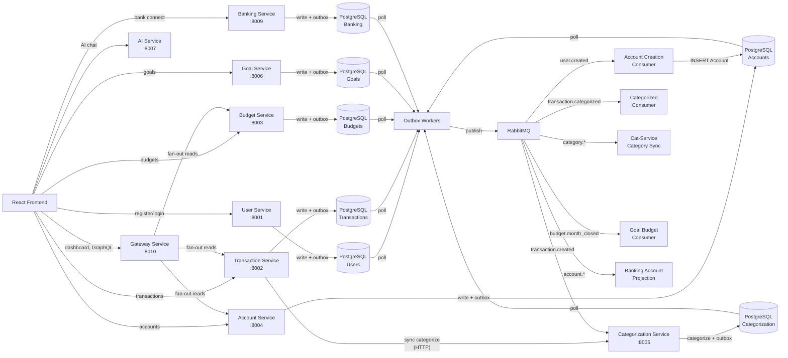
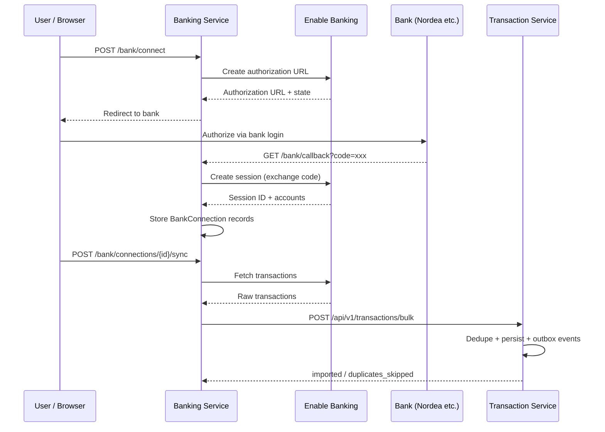
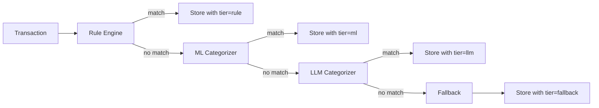

# Finance Tracker — Microservices Personal Finance Application

A personal finance tracking application built as event-driven microservices. The backend uses FastAPI with hexagonal architecture (ports & adapters), CQRS-lite (REST writes, GraphQL reads), event-driven communication via RabbitMQ, and PostgreSQL database-per-service. Includes live bank integration via Enable Banking (PSD2 Open Banking) with automatic transaction categorization through a multi-tier pipeline (rule engine + ML/LLM tiers prepared).

## Table of Contents

- [Quick Start](#quick-start)
- [Architecture](#architecture)
- [Bank Integration](#bank-integration)
- [Categorization Pipeline](#categorization-pipeline)
- [Service Map](#service-map)
- [Project Structure](#project-structure)
- [API Reference](#api-reference)
- [Event-Driven Architecture](#event-driven-architecture)
- [Configuration](#configuration)
- [Testing](#testing)
- [Development](#development)

---

## Quick Start

### Prerequisites

- Python 3.11+
- `uv` (Python package manager)
- Node.js 18+ and `yarn` (for frontend)
- Docker Desktop

### Start everything

```bash
docker compose up -d
```

This starts all services:

| Service | Port | Description |
|---------|------|-------------|
| PostgreSQL (users) | 5433 | User-service database |
| PostgreSQL (transactions) | 5434 | Transaction-service database |
| PostgreSQL (categorization) | 5435 | Categorization-service database |
| PostgreSQL (accounts) | 5436 | Account-service database |
| PostgreSQL (budgets) | 5437 | Budget-service database |
| PostgreSQL (goals) | 5438 | Goal-service database |
| PostgreSQL (banking) | 5439 | Banking-service database |
| RabbitMQ | 5672 / 15672 | Event bus + management UI |
| Redis | 6379 | Cache for transaction/budget services |
| User Service | 8001 | Registration, login, JWT issuing |
| Transaction Service | 8002 | Transaction CRUD, CSV import, planned transactions |
| Budget Service | 8003 | Budget management, monthly summaries |
| Account Service | 8004 | Account CRUD, account groups |
| Categorization Service | 8005 | Rule/ML/LLM categorization pipeline |
| Goal Service | 8006 | Savings goals |
| AI Service | 8007 | RAG-based financial Q&A (Ollama + ChromaDB) |
| Banking Service | 8009 | PSD2 bank integration (Enable Banking) |
| Gateway Service | 8010 | Dashboard REST + GraphQL reads (BFF) |

**Wait 30-60 seconds** for health checks to pass.

### Frontend

```bash
cd services/frontend
yarn install
yarn dev
```

App: http://localhost:3000

### Verify services

```bash
curl http://localhost:8001/health   # User Service
curl http://localhost:8002/health   # Transaction Service
curl http://localhost:8003/health   # Budget Service
curl http://localhost:8004/health   # Account Service
curl http://localhost:8005/health   # Categorization Service
curl http://localhost:8006/health   # Goal Service
curl http://localhost:8007/health   # AI Service
curl http://localhost:8009/health   # Banking Service
curl http://localhost:8010/health   # Gateway Service
```

---

## Architecture

### System Overview

The application is a fully decomposed microservices architecture. Each bounded context owns its data (database-per-service) and communicates via events through RabbitMQ.


```mermaid
graph LR
    FE[React Frontend] -->|register/login| US[User Service<br/>:8001]
    FE -->|transactions| TS[Transaction Service<br/>:8002]
    FE -->|accounts| AS[Account Service<br/>:8004]
    FE -->|budgets| BS[Budget Service<br/>:8003]
    FE -->|goals| GS[Goal Service<br/>:8006]
    FE -->|dashboard, GraphQL| GW[Gateway Service<br/>:8010]
    FE -->|bank connect| BANK[Banking Service<br/>:8009]
    FE -->|AI chat| AI[AI Service<br/>:8007]

    US -->|"write + outbox"| PG_U[(PostgreSQL<br/>Users)]
    TS -->|"write + outbox"| PG_T[(PostgreSQL<br/>Transactions)]
    AS -->|"write + outbox"| PG_A[(PostgreSQL<br/>Accounts)]
    BS -->|"write + outbox"| PG_B[(PostgreSQL<br/>Budgets)]
    GS -->|"write + outbox"| PG_G[(PostgreSQL<br/>Goals)]
    BANK -->|"write + outbox"| PG_BK[(PostgreSQL<br/>Banking)]
    CS[Categorization Service<br/>:8005] -->|"categorize + outbox"| PG_C[(PostgreSQL<br/>Categorization)]

    TS -->|"sync categorize<br/>(HTTP)"| CS
    GW -->|"fan-out reads"| TS
    GW -->|"fan-out reads"| AS
    GW -->|"fan-out reads"| BS

    PG_U -->|poll| UOW[Outbox Workers]
    PG_T -->|poll| UOW
    PG_A -->|poll| UOW
    PG_B -->|poll| UOW
    PG_G -->|poll| UOW
    PG_BK -->|poll| UOW
    PG_C -->|poll| UOW

    UOW -->|publish| RMQ[RabbitMQ]

    RMQ -->|user.created| ACC[Account Creation<br/>Consumer]
    RMQ -->|transaction.created| CS
    RMQ -->|transaction.categorized| TCC[Categorized<br/>Consumer]
    RMQ -->|category.*| CCSC[Cat-Service<br/>Category Sync]
    RMQ -->|budget.month_closed| GBC[Goal Budget<br/>Consumer]
    RMQ -->|account.*| BAPC[Banking Account<br/>Projection]

    ACC -->|INSERT Account| PG_A
```

### Bank Integration (PSD2 Open Banking)

The banking-service connects to real bank accounts via [Enable Banking](https://enablebanking.com/) using the PSD2 Open Banking standard.


```mermaid
sequenceDiagram
    participant User as User / Browser
    participant API as Banking Service
    participant EB as Enable Banking
    participant Bank as Bank (Nordea etc.)
    participant TS as Transaction Service

    User->>API: POST /bank/connect
    API->>EB: Create authorization URL
    EB-->>API: Authorization URL + state
    API-->>User: Redirect to bank

    User->>Bank: Authorize via bank login
    Bank-->>API: GET /bank/callback?code=xxx

    API->>EB: Create session (exchange code)
    EB-->>API: Session ID + accounts
    API->>API: Store BankConnection records

    User->>API: POST /bank/connections/{id}/sync
    API->>EB: Fetch transactions
    EB-->>API: Raw transactions
    API->>TS: POST /api/v1/transactions/bulk
    TS->>TS: Dedupe + persist + outbox events
    TS-->>API: imported / duplicates_skipped
```

### Categorization Pipeline

Transactions are categorized through a multi-tier orchestrator:


```mermaid
flowchart LR
    TX[Transaction] --> RE[Rule Engine]
    RE -->|match| Done[Store with tier=rule]
    RE -->|no match| ML[ML Categorizer]
    ML -->|match| Done2[Store with tier=ml]
    ML -->|no match| LLM[LLM Categorizer]
    LLM -->|match| Done3[Store with tier=llm]
    LLM -->|no match| FB[Fallback]
    FB --> Done4[Store with tier=fallback]
```

### Key Architecture Decisions

| Decision | Rationale |
|----------|-----------|
| **PostgreSQL-only** | All services use PostgreSQL. NUMERIC type for money, async drivers |
| **Database-per-service** | No cross-service DB access, only events |
| **Event-driven sync** | `user.created` triggers default account creation; `transaction.created` triggers categorization |
| **Shared JWT secret** | All services validate tokens with the same secret. User-service is the sole token issuer |
| **Transactional outbox** | Domain data and event written in same DB transaction. Worker polls with `SELECT ... FOR UPDATE SKIP LOCKED` and publishes to RabbitMQ |
| **Gateway as BFF** | `gateway-service` fans out to multiple services for dashboard/analytics reads |
| **REST for mutations, GraphQL for reads** | Writes via REST; nested dashboard reads via GraphQL |
| **Multi-tier categorization** | Rule engine first (fast, deterministic), then ML/LLM (expensive, probabilistic) |
| **PSD2 via Enable Banking** | Aggregator abstracts bank-specific APIs; JWT-signed requests; OAuth for user consent |

### Hexagonal Architecture (per service)

Each bounded context follows the same structure:

```text
adapters/
├── inbound/       # REST API controllers
└── outbound/      # Repository implementations, event publishers
application/
├── ports/         # Inbound + outbound interfaces (ABC)
├── service.py     # Application service (business rules)
└── dto.py         # Pydantic DTOs
domain/
├── entities.py    # Frozen dataclasses (immutable domain objects)
└── exceptions.py  # Domain exceptions
```

### CQRS Split

| Operation | Protocol | Example |
|-----------|----------|---------|
| Commands (write) | REST | `POST /api/v1/transactions/` |
| Queries (read) | GraphQL | `query { financialOverview { ... } }` |
| Domain-specific reads | REST | `GET /api/v1/transactions/` |

---

## Service Map

| Service | Port | Database | Role |
|---------|------|----------|------|
| **User Service** | 8001 | PostgreSQL (5433) | User registration, login, JWT issuing |
| **Transaction Service** | 8002 | PostgreSQL (5434) | Transaction CRUD, CSV import, planned transactions, categories |
| **Budget Service** | 8003 | PostgreSQL (5437) | Budgets, monthly budget summaries |
| **Account Service** | 8004 | PostgreSQL (5436) | Account CRUD, account groups |
| **Categorization Service** | 8005 | PostgreSQL (5435) | Transaction categorization pipeline |
| **Goal Service** | 8006 | PostgreSQL (5438) | Savings goals and goal events |
| **AI Service** | 8007 | ChromaDB | RAG-based financial Q&A (Ollama + ChromaDB) |
| **Banking Service** | 8009 | PostgreSQL (5439) | PSD2 bank integration (Enable Banking) |
| **Gateway Service** | 8010 | — (fans out) | Dashboard REST + GraphQL BFF |

### Workers & Consumers

| Worker | Role |
|--------|------|
| User Outbox Worker | Publishes user events to RabbitMQ |
| Transaction Outbox Worker | Publishes transaction events to RabbitMQ |
| Account Outbox Publisher | Publishes account events to RabbitMQ |
| Budget Outbox Worker | Publishes budget events to RabbitMQ |
| Categorization Outbox Worker | Publishes categorization events to RabbitMQ |
| Goal Outbox Worker | Publishes goal events to RabbitMQ |
| Banking Outbox Worker | Publishes banking events to RabbitMQ |
| Account Creation Consumer | Creates default account on `user.created` |
| Transaction Categorized Consumer | Writes categorization results back to transaction-service |
| Categorization Category Sync | Syncs categories from transaction-service |
| Categorization Transaction Consumer | Triggers async categorization on `transaction.created` |
| Goal Budget Consumer | Handles `budget.month_closed` events |
| Banking Account Projection | Projects account events into banking-service |

---

## Project Structure

```text
Finance-Tracker/
├── services/
│   ├── user-service/           # Auth, registration, JWT
│   ├── transaction-service/    # Transactions, CSV import
│   ├── budget-service/         # Budgets, monthly summaries
│   ├── account-service/        # Accounts, account groups
│   ├── categorization-service/ # Rule/ML/LLM categorization
│   ├── goal-service/           # Savings goals
│   ├── ai-service/             # RAG Q&A (Ollama + ChromaDB)
│   ├── banking-service/        # PSD2 bank integration
│   ├── gateway-service/        # Dashboard BFF (GraphQL + REST)
│   ├── frontend/               # React + Vite SPA
│   ├── shared/                 # Event contracts + auth lib
│   └── serverless-health-job/  # KEDA health monitor
├── k8s/                        # Kubernetes manifests (Kustomize)
├── tests/e2e/                  # End-to-end tests
├── scripts/                    # Dev/ops utility scripts
├── docs/                       # ADRs, migration history
├── docker-compose.yml          # Local development stack
└── Makefile                    # Orchestration targets
```

---

## Event-Driven Architecture

### Exchange & Routing

All services publish to a single topic exchange: `finans_tracker.events`

| Routing Key | Publisher | Consumers |
|-------------|-----------|-----------|
| `user.created` | user-service | account-creation-consumer |
| `transaction.created` | transaction-service | categorization-service |
| `transaction.categorized` | categorization-service | transaction-categorized-consumer |
| `category.*` | transaction-service | categorization-category-sync |
| `account.*` | account-service | banking-account-projection |
| `budget.month_closed` | budget-service | goal-budget-consumer |

### Outbox Pattern

Each service writes domain events to an `outbox_events` table in the same transaction as the domain write. A dedicated outbox worker polls with `SELECT ... FOR UPDATE SKIP LOCKED` and publishes to RabbitMQ, ensuring at-least-once delivery without dual-write problems.

---

## Configuration

### Environment Variables

See `example.env` for all available options.

| Variable | Required | Default | Description |
|----------|----------|---------|-------------|
| `SECRET_KEY` | Yes | — | JWT secret for token signing |
| `ENVIRONMENT` | No | development | development/staging/production |
| `CORS_ORIGINS` | No | localhost:3000 | Allowed CORS origins |
| `ENABLE_BANKING_APP_ID` | For banking | — | Enable Banking app ID |
| `ENABLE_BANKING_KEY_PATH` | For banking | — | Path to PEM private key |

Each service reads its own `DATABASE_URL` from the environment (set in docker-compose.yml).

---

## Testing

```bash
# Run all service tests
make test

# Run E2E tests (requires docker compose up)
make test-e2e

# Run tests for a specific service
make -C services/user-service test
```

---

## Development

### CLI Commands

| Command | Description |
|---------|-------------|
| `make install-deps` | Install deps for all services |
| `make dev` | Start infra, print instructions |
| `make dev-docker` | Start everything in Docker |
| `make down` | Stop all Docker containers |
| `make logs` | Tail Docker container logs |
| `make build` | Build all Docker images |
| `make test` | Run all tests |
| `make test-e2e` | Run E2E tests |
| `make lint` | Run ruff on all Python services |
| `make format` | Auto-format all Python services |
| `make check` | Run all quality checks |

### Frontend development

```bash
cd services/frontend
yarn install
yarn dev
```

### Adding a new service

1. Create `services/<name>/` with hexagonal structure
2. Add PostgreSQL instance to `docker-compose.yml`
3. Add outbox worker if the service publishes events
4. Add shared event contracts to `services/shared/contracts/`
5. Add K8s manifest to `k8s/apps/`
