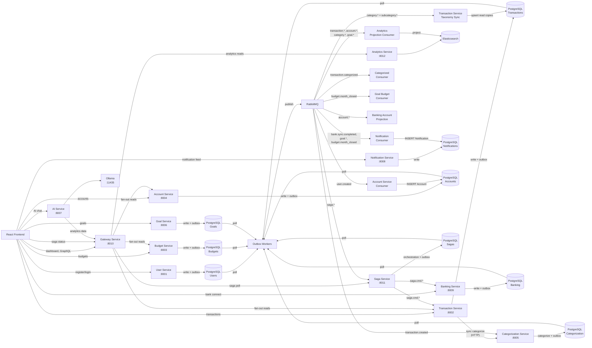
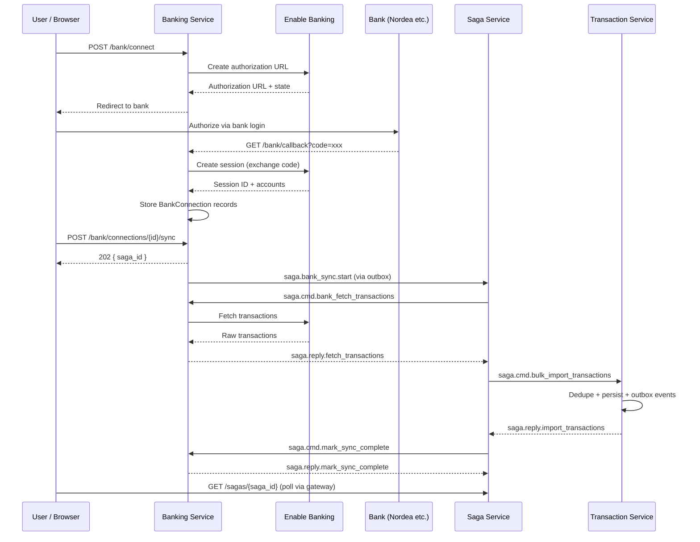
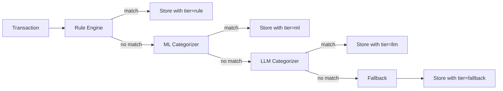
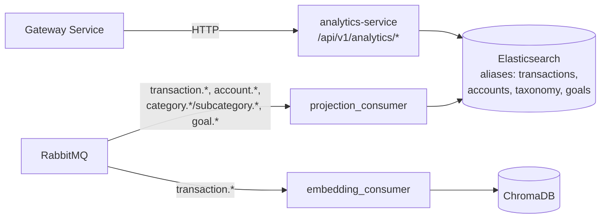
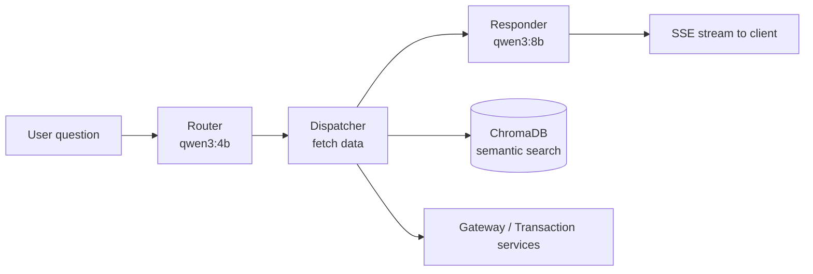
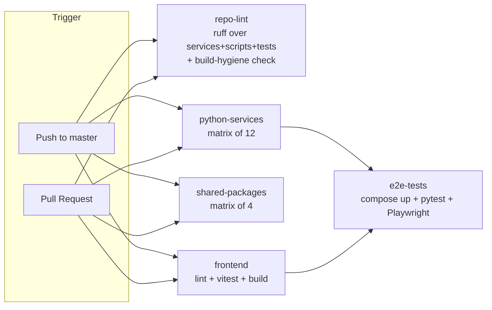

# Finance Tracker — Microservices Personal Finance Application

A personal finance tracking application built as event-driven microservices. The backend uses FastAPI with hexagonal architecture (ports & adapters), CQRS-lite (REST writes, GraphQL reads via gateway-service), event-driven communication via RabbitMQ, and PostgreSQL database-per-service. Includes live bank integration via Enable Banking (PSD2 Open Banking) with distributed saga orchestration for bank sync, automatic transaction categorization through a multi-tier pipeline (rule engine live; ML/LLM tiers prepared), an Elasticsearch-backed denormalized read store for analytics, an in-app notification feed, and a streaming AI chat assistant powered by Ollama and ChromaDB.

The legacy Django/MySQL monolith is gone — the `services/monolith/` directory no longer exists in the repo. All reads go through gateway-service (port 8010), which aggregates domain services and the Elasticsearch read side in analytics-service.

## Table of Contents

- [Quick Start](#quick-start)
- [Architecture](#architecture)
- [Bank Integration](#bank-integration)
- [Distributed Sagas](#distributed-sagas)
- [Categorization Pipeline](#categorization-pipeline)
- [Analytics Read Store](#analytics-read-store)
- [Notifications](#notifications)
- [AI Chat Pipeline](#ai-chat-pipeline)
- [Service Map](#service-map)
- [Project Structure](#project-structure)
- [API Reference](#api-reference)
- [Event-Driven Architecture](#event-driven-architecture)
- [Configuration](#configuration)
- [Kubernetes Deployment](#kubernetes-deployment)
- [CI/CD Pipeline](#cicd-pipeline)
- [Monitoring](#monitoring)
- [Testing](#testing)
- [Development](#development)
- [Helper Scripts](#helper-scripts)
- [Documentation](#documentation)

---

## Quick Start

### Prerequisites

- Python 3.11+
- `uv` (Python package manager)
- Node.js 18+ and `npm` (for frontend)
- Docker Desktop

### Start everything

```bash
docker compose up -d
```

This starts all services:

| Service | Port | Description |
|---------|------|-------------|
| PostgreSQL (users) | 5433 | User-service database |
| PostgreSQL (transactions) | 5434 | Transaction-service database |
| PostgreSQL (categorization) | 5435 | Categorization-service database |
| PostgreSQL (accounts) | 5436 | Account-service database |
| PostgreSQL (budgets) | 5437 | Budget-service database |
| PostgreSQL (goals) | 5438 | Goal-service database |
| PostgreSQL (banking) | 5439 | Banking-service database |
| PostgreSQL (saga) | 5440 | Saga-service database |
| PostgreSQL (notifications) | 5441 | Notification-service database |
| RabbitMQ | 5672 / 15672 | Event bus + management UI |
| Redis | 6380 | Cache for transaction/budget services |
| Elasticsearch | 9200 | Denormalized read store (analytics-service) |
| Ollama | 11435 | Local LLM runtime (qwen3 + bge-m3) |
| User Service | 8001 | Registration, login, JWT issuing |
| Transaction Service | 8002 | Transaction CRUD, CSV import, planned transactions |
| Budget Service | 8003 | Budget management, monthly summaries |
| Account Service | 8004 | Account CRUD, account groups |
| Categorization Service | 8005 | Rule/ML/LLM categorization pipeline |
| Goal Service | 8006 | Savings goals, budget surplus allocation |
| AI Service | 8007 | Streaming financial Q&A (Ollama + ChromaDB) |
| Notification Service | 8008 | In-app notification feed |
| Banking Service | 8009 | PSD2 bank integration (Enable Banking) |
| Gateway Service | 8010 | Dashboard REST + GraphQL reads (BFF) |
| Saga Service | 8011 | Distributed saga orchestration (bank sync) |
| Analytics Service | 8012 | Elasticsearch-backed analytics reads |
| Frontend (nginx) | 3000 | Built SPA behind the nginx perimeter |

In total 53 compose services: 12 HTTP services, 26 workers/consumers/schedulers, the frontend, and 14 infrastructure containers.

**Wait 30–60 seconds** for health checks to pass. The `ollama-pull` init container downloads `qwen3:4b` and `bge-m3` on first start.

Note that `docker compose up -d` serves the **built** frontend image on port 3000 behind nginx (CSP + rate limits, see ADR-0005). `npm run dev` uses the same port but bypasses the perimeter — browser tests must run against the built image.

### Frontend

```bash
cd services/frontend
npm install
npm run dev
```

App: http://localhost:3000

### Verify services

```bash
curl http://localhost:8001/health   # User Service
curl http://localhost:8002/health   # Transaction Service
curl http://localhost:8003/health   # Budget Service
curl http://localhost:8004/health   # Account Service
curl http://localhost:8005/health   # Categorization Service
curl http://localhost:8006/health   # Goal Service
curl http://localhost:8007/health   # AI Service
curl http://localhost:8008/health   # Notification Service
curl http://localhost:8009/health   # Banking Service
curl http://localhost:8010/health   # Gateway Service
curl http://localhost:8011/health   # Saga Service
curl http://localhost:8012/health   # Analytics Service
```

Banking-service also exposes `/ready`, which touches its DB and Enable Banking configuration — liveness alone was not enough to catch a service that starts but cannot work (P2-42b). `make compose-state-check` asserts no container is dead, exited nonzero, or restarting.

---

## Architecture

### System Overview

The application is a fully decomposed microservices architecture. Each bounded context owns its data (database-per-service) and communicates via events through RabbitMQ. Long-running cross-service flows (bank sync) use the saga-service for orchestration with compensation on failure.


```mermaid
graph LR
    FE[React Frontend] -->|register/login| US[User Service<br/>:8001]
    FE -->|transactions| TS[Transaction Service<br/>:8002]
    FE -->|accounts| AS[Account Service<br/>:8004]
    FE -->|budgets| BS[Budget Service<br/>:8003]
    FE -->|goals| GS[Goal Service<br/>:8006]
    FE -->|dashboard, GraphQL| GW[Gateway Service<br/>:8010]
    FE -->|bank connect| BANK[Banking Service<br/>:8009]
    FE -->|AI chat| AI[AI Service<br/>:8007]
    FE -->|notification feed| NS[Notification Service<br/>:8008]
    FE -->|saga status| GW

    GW -->|saga poll| SAGA[Saga Service<br/>:8011]
    GW -->|"analytics reads"| ANS[Analytics Service<br/>:8012]
    ANS --> ES[(Elasticsearch)]
    NS -->|write| PG_N[(PostgreSQL<br/>Notifications)]

    US -->|"write + outbox"| PG_U[(PostgreSQL<br/>Users)]
    TS -->|"write + outbox"| PG_T[(PostgreSQL<br/>Transactions)]
    AS -->|"write + outbox"| PG_A[(PostgreSQL<br/>Accounts)]
    BS -->|"write + outbox"| PG_B[(PostgreSQL<br/>Budgets)]
    GS -->|"write + outbox"| PG_G[(PostgreSQL<br/>Goals)]
    BANK -->|"write + outbox"| PG_BK[(PostgreSQL<br/>Banking)]
    SAGA -->|"orchestration + outbox"| PG_S[(PostgreSQL<br/>Sagas)]
    CS[Categorization Service<br/>:8005] -->|"categorize + outbox"| PG_C[(PostgreSQL<br/>Categorization)]

    TS -->|"sync categorize<br/>(HTTP)"| CS
    GW -->|"fan-out reads"| TS
    GW -->|"fan-out reads"| AS
    GW -->|"fan-out reads"| BS
    AI -->|"analytics data"| GW
    AI --> OLL[Ollama<br/>:11435]

    PG_U -->|poll| UOW[Outbox Workers]
    PG_T -->|poll| UOW
    PG_A -->|poll| UOW
    PG_B -->|poll| UOW
    PG_G -->|poll| UOW
    PG_BK -->|poll| UOW
    PG_C -->|poll| UOW
    PG_S -->|poll| UOW

    UOW -->|publish| RMQ[RabbitMQ]

    RMQ -->|user.created| ASC[Account Service<br/>Consumer]
    RMQ -->|transaction.created| CS
    RMQ -->|transaction.categorized| TCC[Categorized<br/>Consumer]
    RMQ -->|"category.* + subcategory.*"| TXC[Transaction Service<br/>Taxonomy Sync]
    RMQ -->|budget.month_closed| GBC[Goal Budget<br/>Consumer]
    RMQ -->|account.*| BAPC[Banking Account<br/>Projection]
    RMQ -->|saga.*| SAGA
    RMQ -->|"transaction.*, account.*,<br/>category.*, goal.*"| APC[Analytics<br/>Projection Consumer]
    RMQ -->|"bank.sync.completed,<br/>goal.*, budget.month_closed"| NC[Notification<br/>Consumer]
    SAGA -->|saga.cmd.*| BANK
    SAGA -->|saga.cmd.*| TS

    ASC -->|INSERT Account| PG_A
    TXC -->|"upsert read copies"| PG_T
    APC -->|project| ES
    NC -->|INSERT Notification| PG_N
```

### Key Architecture Decisions

| Decision | Rationale |
|----------|-----------|
| **PostgreSQL-only** | All active services use PostgreSQL. NUMERIC type for money, async drivers |
| **Database-per-service** | No cross-service DB access, only events and HTTP between bounded contexts |
| **Event-driven sync** | `user.created` triggers default account creation; `transaction.created` triggers categorization |
| **Shared JWT secret** | All services validate tokens with the same secret. User-service is the sole token issuer |
| **Transactional outbox** | Domain data and event written in same DB transaction. Worker polls with `SELECT ... FOR UPDATE SKIP LOCKED` |
| **Gateway as BFF** | `gateway-service` fans out to multiple services for dashboard/analytics reads and saga status |
| **REST for mutations, GraphQL for reads** | Writes via REST on domain services; nested dashboard reads via GraphQL on gateway |
| **Distributed sagas** | Bank sync orchestrated by saga-service with compensation (rollback import on failure) |
| **Multi-tier categorization** | Rule engine first (fast, deterministic), then ML/LLM (expensive, probabilistic) |
| **PSD2 via Enable Banking** | Aggregator abstracts bank-specific APIs; JWT-signed requests; OAuth for user consent |
| **Monolith retired** | MySQL monolith and its sync consumers are deleted; gateway-service is the sole read entry point for clients |
| **Elasticsearch read store** | Aggregations and Danish full-text search live in analytics-service, not in the gateway. Idempotency via document `_id` + event-timestamp guards rather than a `processed_events` table ([ADR-0004](docs/adr/0004-analytics-elasticsearch-read-store.md)) |
| **Single taxonomy owner** | categorization-service owns and writes categories/subcategories; every other service holds event-synced read copies ([ADR-003](docs/ADR-003-taxonomy-ownership-consolidated.md)) |
| **nginx as security perimeter** | The built frontend image terminates CSP and rate limits in front of the SPA ([ADR-0005](docs/adr/0005-nginx-as-security-perimeter.md)) |

### Hexagonal Architecture (per service)

Each bounded context follows the same structure:

```text
adapters/
├── inbound/       # REST API controllers
└── outbound/      # Repository implementations, event publishers, HTTP clients
application/
├── ports/         # Inbound + outbound interfaces (ABC)
├── service.py     # Application service (business rules)
└── dto.py         # Pydantic DTOs
domain/
├── entities.py    # Frozen dataclasses (immutable domain objects)
└── exceptions.py  # Domain exceptions
```

### CQRS Split

| Operation | Protocol | Example |
|-----------|----------|---------|
| Commands (write) | REST | `POST /api/v1/transactions/` |
| Queries (read) | GraphQL | `query { financialOverview { ... } }` |
| Domain-specific reads | REST | `GET /api/v1/transactions/` |
| Saga status | REST (via gateway) | `GET /api/v1/sagas/{saga_id}` |

---

## Bank Integration

The banking-service connects to real bank accounts via [Enable Banking](https://enablebanking.com/) using the PSD2 Open Banking standard. Bank sync is orchestrated as a distributed saga (see [Distributed Sagas](#distributed-sagas)).


```mermaid
sequenceDiagram
    participant User as User / Browser
    participant API as Banking Service
    participant EB as Enable Banking
    participant Bank as Bank (Nordea etc.)
    participant Saga as Saga Service
    participant Tx as Transaction Service

    User->>API: POST /bank/connect
    API->>EB: Create authorization URL
    EB-->>API: Authorization URL + state
    API-->>User: Redirect to bank

    User->>Bank: Authorize via bank login
    Bank-->>API: GET /bank/callback?code=xxx

    API->>EB: Create session (exchange code)
    EB-->>API: Session ID + accounts
    API->>API: Store BankConnection records

    User->>API: POST /bank/connections/{id}/sync
    API-->>User: 202 { saga_id }
    API->>Saga: saga.bank_sync.start (via outbox)

    Saga->>API: saga.cmd.bank_fetch_transactions
    API->>EB: Fetch transactions
    EB-->>API: Raw transactions
    API-->>Saga: saga.reply.fetch_transactions

    Saga->>Tx: saga.cmd.bulk_import_transactions
    Tx->>Tx: Dedupe + persist + outbox events
    Tx-->>Saga: saga.reply.import_transactions

    Saga->>API: saga.cmd.mark_sync_complete
    API-->>Saga: saga.reply.mark_sync_complete

    User->>Saga: GET /sagas/{saga_id} (poll via gateway)
```

---

## Distributed Sagas

The saga-service (port 8011) orchestrates multi-step workflows across services via RabbitMQ command/reply events. Phase 1 implements the **bank sync saga**: fetch transactions → bulk import → mark sync complete, with rollback on failure.

| Worker | Role |
|--------|------|
| `saga-start-consumer` | Starts saga instances on `saga.*.start` events |
| `saga-reply-consumer` | Advances saga on participant replies |
| `saga-outbox-worker` | Publishes saga commands from outbox |
| `saga-timeout-worker` | Marks stale sagas as timed out |
| `banking-saga-command-consumer` | Executes banking-side saga steps |
| `transaction-saga-command-consumer` | Executes transaction-side saga steps (bulk import, rollback) |

Poll saga status from the frontend via gateway:

```bash
curl -H "Authorization: Bearer $TOKEN" http://localhost:8010/api/v1/sagas/{saga_id}
```

See `services/saga-service/README.md` for full saga architecture details.

---

## Categorization Pipeline

Transactions are categorized through a multi-tier orchestrator:


```mermaid
flowchart LR
    TX[Transaction] --> RE[Rule Engine]
    RE -->|match| Done[Store with tier=rule]
    RE -->|no match| ML[ML Categorizer]
    ML -->|match| Done2[Store with tier=ml]
    ML -->|no match| LLM[LLM Categorizer]
    LLM -->|match| Done3[Store with tier=llm]
    LLM -->|no match| FB[Fallback]
    FB --> Done4[Store with tier=fallback]
```

The rule engine tier is live. ML and LLM tiers are implemented but not yet wired in production paths.

`is_user_confirmed` protects a manual choice: automatic re-categorization never
overwrites it. User corrections are learned as auto-managed rules by
`categorization-correction-consumer` (F1-03).

---

## Analytics Read Store

The analytics-service (port 8012) is the CQRS read side: an Elasticsearch-backed
denormalized store that the gateway reads from instead of aggregating across
domain services itself.


```mermaid
flowchart LR
    RMQ[RabbitMQ] -->|"transaction.*, account.*,<br/>category.*/subcategory.*, goal.*"| PC[projection_consumer]
    PC --> ES[(Elasticsearch<br/>aliases: transactions,<br/>accounts, taxonomy, goals)]
    RMQ -->|transaction.*| EC[embedding_consumer]
    EC --> CDB[(ChromaDB)]
    GW[Gateway Service] -->|HTTP| API["analytics-service<br/>/api/v1/analytics/*"]
    API --> ES
```

| Aspect | Detail |
|--------|--------|
| Write side | `projection_consumer` projects events into ES indices behind aliases |
| Idempotency | Document `_id` + event-timestamp guards — **no** `processed_events` table, unlike other consumers ([ADR-0004](docs/adr/0004-analytics-elasticsearch-read-store.md)) |
| Read side | Aggregations and Danish full-text search run in ES, behind the gateway's outbound port |
| Domain layer | `app/domain/` owns the canonical expense/income classification and budget-month period rules |
| Backfill | `python -m app.tools.backfill` for historical data; it writes with `event_ts=0` so live events always win |
| Embeddings | `embedding_consumer` writes transaction embeddings to ChromaDB for the AI service's semantic search |

A read model does not self-heal against events that were never emitted. When a
projection looks wrong, diff the id sets across the whole dataset rather than
spot-checking rows.

---

## Notifications

The notification-service (port 8008) turns domain events into a per-user in-app
feed, surfaced by the frontend's `NotificationBell`.

| Trigger event | Notification |
|---------------|--------------|
| `bank.sync.completed` | "Banksynkronisering færdig" |
| `goal.updated` where current ≥ target | "Mål nået! 🎉" (manual edit reaching the target) |
| `goal.reached` | "Mål nået! 🎉" (automatic surplus allocation completes a goal — F1-08) |
| `budget.month_closed` | "Måned lukket" (+ surplus) |
| `budget.line_threshold_crossed` | Mid-month 80% / 100% budget alerts (F2-03) |

Delivery is at-least-once, so each notification carries a deterministic
`source_key` under a unique index — redeliveries and repeated `goal.updated`
events collapse onto the same row, and both goal paths dedupe on
`goal.reached:{goal_id}`. `transaction.categorized` is deliberately **not**
consumed (too noisy). Email is deferred: `IEmailPort` exists with a no-op
adapter so SMTP can be wired later without touching the application layer.

See `services/notification-service/README.md`.

---

## AI Chat Pipeline

The AI service exposes a 3-step streaming SSE pipeline for financial Q&A:


```mermaid
flowchart LR
    Q[User question] --> R[Router<br/>qwen3:4b]
    R --> D[Dispatcher<br/>fetch data]
    D --> P[Responder<br/>qwen3:8b]
    P --> SSE[SSE stream to client]
    D --> CDB[(ChromaDB<br/>semantic search)]
    D --> GW[Gateway / Transaction services]
```

| Endpoint | Description |
|----------|-------------|
| `POST /api/v1/chat/stream` | SSE streaming chat (JWT required) |
| `POST /api/v1/ingest` | Embed user transactions into ChromaDB |
| `GET /health` | Health check |

See `services/ai-service/README.md` for model configuration and intent types.

---

## Service Map

| Service | Port | Database | Role |
|---------|------|----------|------|
| **User Service** | 8001 | PostgreSQL (5433) | User registration, login, JWT issuing |
| **Transaction Service** | 8002 | PostgreSQL (5434) | Transaction CRUD, CSV import, planned transactions (taxonomy: event-synced read copies only, per ADR-003) |
| **Budget Service** | 8003 | PostgreSQL (5437) | Budgets, monthly budget summaries |
| **Account Service** | 8004 | PostgreSQL (5436) | Account CRUD, account groups |
| **Categorization Service** | 8005 | PostgreSQL (5435) | Categorization pipeline **and sole owner/writer of the taxonomy** (categories, subcategories, merchants, rules) per ADR-003. Taxonomy reads are JWT'd; writes are internal-only under `/api/v1/internal/` (P2-28) |
| **Goal Service** | 8006 | PostgreSQL (5438) | Savings goals, budget surplus allocation |
| **AI Service** | 8007 | ChromaDB (volume) | Streaming financial Q&A (Ollama + ChromaDB) |
| **Notification Service** | 8008 | PostgreSQL (5441) | In-app notification feed (bank sync done, goal reached, month closed, budget thresholds) |
| **Banking Service** | 8009 | PostgreSQL (5439) | PSD2 bank integration (Enable Banking) |
| **Gateway Service** | 8010 | — (fans out) | Dashboard REST + GraphQL BFF |
| **Saga Service** | 8011 | PostgreSQL (5440) | Distributed saga orchestration |
| **Analytics Service** | 8012 | Elasticsearch (9200) | Denormalized CQRS read store: overview, expenses/cashflow by month, comparison, Danish full-text transaction search, top merchants |

All twelve services are live in `docker-compose.yml` and in the CI matrix. The
earlier "Analytics = stub, Notification = planned" state no longer holds:
analytics-service is the read side the gateway reads from, and
notification-service backs the frontend's notification bell.

### Removed Components

The following components have been retired and are no longer part of the runtime stack:

| Component | Replaced by |
|-----------|-------------|
| Django monolith (`services/monolith/`) | gateway-service (BFF reads), domain services (writes) |
| MySQL database | PostgreSQL database-per-service |
| 4 sync consumers (user, category, transaction, account) | Event-driven consumers on domain services |

The monolith directory has been deleted from the repo — it is not merely excluded from `docker-compose.yml`. Nothing in the runtime stack, CI, or `k8s/` refers to it.

### Workers & Consumers

All **26** worker containers, matching `docker compose config --services`
(`make compose-check` counts them):

| Worker (compose service) | Role |
|--------|------|
| `user-outbox-worker` | Publishes user events to RabbitMQ |
| `transaction-outbox-worker` | Publishes transaction events to RabbitMQ |
| `account-outbox-publisher` | Publishes account events to RabbitMQ |
| `budget-outbox-worker` | Publishes budget events to RabbitMQ |
| `categorization-outbox-worker` | Publishes categorization + `category.*`/`subcategory.*` events |
| `goal-outbox-worker` | Publishes goal events to RabbitMQ |
| `banking-outbox-worker` | Publishes banking events to RabbitMQ |
| `saga-outbox-worker` | Publishes saga commands to RabbitMQ |
| `account-service-consumer` | Creates default account on `user.created` |
| `transaction-categorized-consumer` | Writes categorization results back to transaction-service |
| `transaction-taxonomy-consumer` | Maintains transaction-service's taxonomy **read copies** from `category.*` + `subcategory.*` (ADR-003; self-healing upserts + inbox idempotency) |
| `categorization-transaction-consumer` | Triggers async categorization on `transaction.created` |
| `categorization-correction-consumer` | Learns user corrections as auto-managed rules (F1-03) |
| `goal-budget-consumer` | Handles `budget.month_closed` (surplus → default goal) |
| `banking-account-projection-consumer` | Projects account events into banking-service |
| `analytics-projection-consumer` | Maintains the Elasticsearch read model (incl. `propagate_category_rename`) |
| `analytics-embedding-consumer` | Embeds transactions into ChromaDB for semantic search |
| `notification-consumer` | Fans domain events out to the in-app notification feed (F1-01) |
| `banking-sync-scheduler` | Staleness-based nightly bank sync (F1-05) |
| `budget-month-close-scheduler` | Day-7 automatic month close (F1-07) |
| `budget-alert-scheduler` | Mid-month 80%/100% budget threshold alerts (F2-03) |
| `saga-start-consumer`, `saga-reply-consumer`, `saga-timeout-worker` | Saga lifecycle management |
| `banking-saga-command-consumer`, `transaction-saga-command-consumer` | Execute saga steps in participating services |

Note the direction of the taxonomy sync: categorization-service **owns and
writes** the taxonomy and transaction-service consumes it (ADR-003). The old
`category-sync-consumer`, which synced the other way into the monolith's MySQL
projection, is removed — see the comment at `docker-compose.yml:273`.

---

## Project Structure

```text
Finance-Tracker/
├── services/
│   ├── user-service/           # Auth, registration, JWT
│   ├── transaction-service/    # Transactions, CSV import, saga participant
│   ├── budget-service/         # Budgets, monthly summaries
│   ├── account-service/        # Accounts, account groups
│   ├── categorization-service/ # Rule/ML/LLM categorization
│   ├── goal-service/           # Savings goals, budget surplus allocation
│   ├── ai-service/             # Streaming Q&A (Ollama + ChromaDB)
│   ├── banking-service/        # PSD2 bank integration, saga participant
│   ├── gateway-service/        # Dashboard BFF (GraphQL + REST)
│   ├── saga-service/           # Distributed saga orchestration
│   ├── analytics-service/      # Elasticsearch read store + projection/embedding workers
│   ├── notification-service/   # In-app notification feed
│   ├── frontend/               # React + Vite SPA (nginx perimeter, Playwright specs in e2e/)
│   ├── shared/                 # 4 path-dep packages: contracts, messaging, auth, domain
│   └── serverless-health-job/  # KEDA health monitor
├── k8s/                        # Kubernetes manifests (Kustomize + monitoring)
├── monitoring/                 # Prometheus/Grafana/Loki configs (local overlay)
├── tests/e2e/                  # End-to-end tests (also run in CI)
├── scripts/                    # Dev/ops utility scripts
├── docs/                       # ADRs, assignment reports, AsyncAPI
├── dev-notes/                  # Working notes: backlog, decisions, findings, plans, STATUS
├── docker-compose.yml          # Local development stack
├── docker-compose.monitoring.yml  # Optional monitoring overlay
└── Makefile                    # Orchestration targets
```

---

## API Reference

Each service exposes versioned REST endpoints under `/api/v1/`. OpenAPI docs are available at `/docs` on each FastAPI service when running locally.

| Service | Key endpoints |
|---------|---------------|
| User | `POST /api/v1/users/register`, `POST /api/v1/users/login`, `GET /api/v1/users/me`, `PUT /api/v1/users/me/password`, `PUT /api/v1/users/me/username` |
| Transaction | `GET/POST /api/v1/transactions/`, `POST /api/v1/transactions/import-csv` |
| Account | `GET/POST /api/v1/accounts/`, `GET/POST /api/v1/account-groups/` |
| Budget | `GET/POST /api/v1/budgets/`, `GET /api/v1/monthly-budgets/summary` |
| Categorization | `GET /api/v1/categories/` (JWT reads); taxonomy **writes** only under `/api/v1/internal/` behind `INTERNAL_API_KEY` (P2-28) |
| Goal | `GET/POST /api/v1/goals/` |
| Notification | `GET /api/v1/notifications`, `GET /api/v1/notifications/unread-count`, `POST /api/v1/notifications/{id}/read`, `POST /api/v1/notifications/read-all`, `DELETE /api/v1/notifications/{id}` |
| Banking | `POST /api/v1/bank/connect`, `POST /api/v1/bank/connections/{id}/sync`, `GET /health`, `GET /ready` |
| Gateway | `GET /api/v1/dashboard/`, `POST /api/v1/graphql`, `GET /api/v1/sagas/{id}` |
| AI | `POST /api/v1/chat/stream` (SSE), `POST /api/v1/ingest` |
| Saga | `GET /api/v1/sagas/{id}` (internal; prefer gateway for authenticated access) |
| Analytics | `GET /api/v1/analytics/overview`, `/expenses-by-month`, `/cashflow-by-month`, `/comparison`, `/transactions`, `/top-merchants`, `POST /api/v1/analytics/search/hybrid` |

Auth lives under `/api/v1/users/`, not `/api/v1/auth/` — an earlier version of this table said the latter, and no such route exists.

GraphQL schema is served by gateway-service at `/api/v1/graphql` (Strawberry).

---

## Event-Driven Architecture

### Exchange & Routing

All services publish to a single topic exchange: `finans_tracker.events`

| Routing Key | Publisher | Consumers |
|-------------|-----------|-----------|
| `user.created` | user-service | account-service-consumer |
| `transaction.*` | transaction-service | categorization-transaction-consumer (`transaction.created`), analytics-projection-consumer, analytics-embedding-consumer |
| `transaction.categorized` | categorization-service | transaction-categorized-consumer, analytics-projection-consumer |
| `category.*` / `subcategory.*` | **categorization-service** (sole taxonomy owner, ADR-003) | transaction-taxonomy-consumer, analytics-projection-consumer |
| `account.*` | account-service | banking-account-projection-consumer, analytics-projection-consumer |
| `budget.month_closed` | budget-service | goal-budget-consumer, notification-consumer |
| `goal.updated` / `goal.reached` | goal-service (`goal.reached` from the budget-surplus allocation handler) | analytics-projection-consumer, notification-consumer |
| `budget.line_threshold_crossed` | budget-alert-scheduler (F2-03) | notification-consumer |
| `bank.sync.completed` | banking-service (saga command consumer, on `mark_sync_complete`) | notification-consumer |
| `saga.bank_sync.start` | banking-service | saga-start-consumer |
| `saga.cmd.*` | saga-service (via outbox) | banking/transaction saga command consumers |
| `saga.reply.*` | participating services | saga-reply-consumer |

The `category.*` row previously named transaction-service as publisher and a
`categorization-category-sync` consumer. That was the pre-ADR-003 direction and
the consumer no longer exists; the sync runs the other way now.

Full payload schemas, queue names and DLQ bindings are documented in
[`docs/asyncapi.yaml`](docs/asyncapi.yaml).

### Outbox Pattern

Each service writes domain events to an `outbox_events` table in the same transaction as the domain write. A dedicated outbox worker polls with `SELECT ... FOR UPDATE SKIP LOCKED` and publishes to RabbitMQ, ensuring at-least-once delivery without dual-write problems. Consumers are idempotent via DB-backed `processed_events` tables.

---

## Configuration

### Environment Variables

See `example.env` for all available options.

| Variable | Required | Default | Description |
|----------|----------|---------|-------------|
| `SECRET_KEY` / `JWT_SECRET` | Yes | — | JWT secret for token signing (shared across services) |
| `INTERNAL_API_KEY` | Yes (inter-service) | — | Service-to-service authentication |
| `ENVIRONMENT` | No | development | development/staging/production |
| `ENABLE_BANKING_APP_ID` | For banking | — | Enable Banking app ID |
| `ENABLE_BANKING_KEY_PATH` | For banking | — | Path to PEM private key |
| `SAGA_SERVICE_URL` | Gateway | `http://saga-service:8011` | Saga service URL |
| `SAGA_TIMEOUT_SECONDS` | No | 300 | Max saga duration before timeout |
| `TIMEOUT_CHECK_INTERVAL_SECONDS` | Saga | 30 | Saga timeout worker poll interval |
| `OLLAMA_BASE_URL` | AI service | `http://ollama:11434` | Ollama server URL |
| `GATEWAY_SERVICE_URL` | AI service | `http://gateway-service:8010` | Gateway URL for analytics data |
| `ELASTICSEARCH_URL` | Analytics | `http://elasticsearch:9200` | Elasticsearch read store |
| `ANALYTICS_SERVICE_URL` | Gateway | `http://analytics-service:8000` | Analytics read-side URL (note: container port 8000, host 8012) |

Each service reads its own `DATABASE_URL` from the environment (set in
`docker-compose.yml`). Alembic's `env.py` reads the same variable — a service
whose `env.py` only reads `alembic.ini` will silently migrate an ephemeral
SQLite file instead.

Several services publish on a container port that differs from the host port:
account-service `8004→8003`, ai-service `8007→8004`, analytics-service
`8012→8000`. Use the host port from the outside and the container port in
inter-service URLs.

Copy the template before local development:

```bash
cp example.env .env
```

---

## Kubernetes Deployment

The full application can be deployed to a local Kubernetes cluster (Docker Desktop) using Kustomize. The `k8s/` directory contains manifests for all services, databases, workers, and monitoring.

```bash
# Build all service images locally
./scripts/build-k8s-images.sh

# Deploy to Kubernetes
kubectl apply -k k8s

# Check status
kubectl get pods -n finance-tracker
```

### Cluster layout

```text
k8s/
├── apps/           # Service deployments (user, transaction, account, banking, etc.)
├── infra/          # PostgreSQL instances, RabbitMQ, Redis, Ollama
├── workers/        # Outbox workers, event consumers, saga workers
├── keda/           # KEDA ScaledJob (serverless health-check)
├── monitoring/     # Prometheus, Grafana, Loki, Promtail, cAdvisor
└── kustomization.yaml
```

### KEDA Serverless Health Job

A KEDA `ScaledJob` monitors service health via a RabbitMQ trigger. When a health-check message is published to the `serverless.health.request`, KEDA scales a one-shot Kubernetes Job that runs the health check and exits. This demonstrates event-driven serverless workloads on Kubernetes without a permanently running pod.

See [`KUBERNETES_GUIDE.md`](KUBERNETES_GUIDE.md) for full prerequisites, step-by-step instructions, and KEDA demo.

---

## CI/CD Pipeline

### GitHub Actions (current)

The project uses GitHub Actions (`.github/workflows/ci.yml`) for continuous integration. The pipeline runs on every push and pull request to `master`/`main`, and consists of five jobs:


```mermaid
flowchart LR
    subgraph trigger [Trigger]
        Push["Push to master"]
        PR["Pull Request"]
    end

    RL["repo-lint<br/>ruff over services+scripts+tests<br/>+ build-hygiene check"]
    PS["python-services<br/>matrix of 12"]
    SP["shared-packages<br/>matrix of 4"]
    FE["frontend<br/>lint + vitest + build"]
    E2E["e2e-tests<br/>compose up + pytest + Playwright"]

    Push --> RL & PS & SP & FE
    PR --> RL & PS & SP & FE
    PS --> E2E
    FE --> E2E
```

| Job | Scope | Steps |
|-----|-------|-------|
| `repo-lint` | Whole repo (`services`, `scripts`, `tests`) | ruff lint + format check, `scripts/compose_check.py` (worker image sharing P3-40, one install path per service P2-37) |
| `python-services` | 12 services | ruff lint, ruff format, **mypy** (allowlisted), bandit, pytest |
| `shared-packages` | `contracts`, `messaging`, `auth`, `domain` | ruff lint, ruff format, bandit, pytest |
| `frontend` | `services/frontend` | eslint, vitest, production build |
| `e2e-tests` | Full compose stack | `pytest tests/e2e`, container-state gate, banking readiness gate, Playwright browser suite |

The `python-services` matrix covers **all twelve** services: account, gateway, user, transaction, budget, goal, ai, categorization, banking, saga, analytics, notification. All run on Python 3.11 with `uv` and test env vars (`TESTING=1`, `JWT_SECRET`, `INTERNAL_API_KEY`).

**The typecheck gate is an allowlist.** `TYPECHECK_SERVICES` in `ci.yml` names the 9 services where `make typecheck` is a hard gate: analytics, user, notification, ai, budget, saga, transaction, categorization, banking. Outside it, with reasons: `goal` (two runtime types for `Goal`), `account` (no `pyproject.toml` to hang mypy on), `gateway` (Strawberry-generated errors, own item). Adding a name to that list *is* the rollout; removing it is the rollback. `make verify-typecheck-gate` asserts the gate covers exactly its allowlist.

**E2E and browser tests run in CI**, not only locally. The `e2e-tests` job brings up the full stack with `compose up --build` and then:

1. `pytest tests/e2e` — hits service ports directly, deliberately bypassing the perimeter. `conftest.py` aborts rather than skips when services are unreachable and `CI` is set, so the job cannot go green with zero tests run.
2. A gate asserting no container is dead, exited nonzero, or restarting (P2-38).
3. A banking dependency-readiness gate — `/ready`, not just liveness (P2-42b).
4. `npm run test:browser` — Playwright against the built frontend image behind nginx.

Every job has an explicit `timeout-minutes` (P2-38), sized from measured baselines rather than guessed — the finding behind it was a job that hung for six hours with no signal.

---

## Monitoring

### Local (Docker Compose overlay)

An optional local monitoring stack (Prometheus, Grafana, Loki, Promtail) is available via compose overlay:

```bash
docker compose -f docker-compose.yml -f docker-compose.monitoring.yml up -d
```

| Service | Port | Description |
|---------|------|-------------|
| Prometheus | 9090 | Metrics collection |
| Grafana | 3001 | Dashboards (admin/admin) |
| Loki | 3100 | Log aggregation |

### Kubernetes (in-cluster)

The Kubernetes deployment includes a full monitoring stack under `k8s/monitoring/`:

- **Prometheus** — collects monitoring data and uses Blackbox Exporter to probe service `/health` endpoints
- **Grafana** — pre-configured dashboards for service health
- **Loki + Promtail** — centralized log aggregation (Promtail as DaemonSet)
- **cAdvisor** — container-level resource metrics (DaemonSet)
- **Blackbox Exporter** — HTTP probe-based availability monitoring

Deploy monitoring with:

```bash
./scripts/monitoring-up.sh
```

See [`docs/MONITORING.md`](docs/MONITORING.md) for detailed setup and dashboard configuration.

---

## Testing

```bash
# Run all service tests
make test

# Run E2E tests (requires docker compose up)
make test-e2e

# Run browser tests against the BUILT frontend behind nginx (needs `make dev-docker` first)
make test-browser

# Run tests for a specific service
make -C services/user-service test
make -C services/saga-service test
```

### Test inventory

Counted by static scan of the repo (`def test_*` / `it(`/`test(` declarations), not by a test-runner collection:

| Layer | Files | Test declarations |
|-------|-------|-------------------|
| Python (services + `tests/e2e`) | 133 | ~1300 |
| Frontend Vitest | 35 | ~346 |
| Playwright browser specs (`services/frontend/e2e/`) | 5 | 5 |

The Python figure includes unit, integration (Testcontainers), architecture
(pytest-archon) and e2e tests. An earlier version of this section claimed
"650+ tests (~490 Python, ~170 frontend)" — that number is roughly half the
current count.

### What the layers are for

- **Unit** — all domain logic, including edge cases. Deterministic: injected clock or freezegun, never `datetime.now()` in domain code.
- **Architecture** — pytest-archon enforces hexagonal boundaries (domain must not import adapters/infrastructure).
- **Integration** — Testcontainers against real PostgreSQL / RabbitMQ / Elasticsearch.
- **E2E** (`tests/e2e/`) — hits service ports directly, bypassing the perimeter on purpose.
- **Browser** (`services/frontend/e2e/`) — Playwright against the built image behind nginx, so CSP and rate limits are in scope. `npm run dev` does *not* exercise the perimeter even though it uses the same port.

A green `make check` is static — it does not import `app.main` under the image's
pinned versions. After touching a Dockerfile or a dependency set, start the
container and read the **workers'** logs, not just the API's.

---

## Development

### CLI Commands

| Command | Description |
|---------|-------------|
| `make help` | List all available targets |
| `make install-deps` | Install deps for all services |
| `make install-hooks` | Enable the tracked git hooks (run once per clone) |
| `make dev` | Start infra, print instructions |
| `make dev-docker` | Start everything in Docker |
| `make down` | Stop all Docker containers |
| `make logs` | Tail Docker container logs |
| `make build` | Build all Docker images |
| `make test` | Run all tests |
| `make test-e2e` | Run E2E tests |
| `make test-browser` | Playwright against the built frontend behind nginx |
| `make lint` / `make format` / `make format-check` | ruff on all Python services |
| `make lint-repo` | Lint + format-check the whole repo, incl. `scripts/` and `tests/` |
| `make check` | All quality checks (lint + format + types + tests) |
| `make compose-check` | Build hygiene: worker image drift (P3-40) + one install path per service (P2-37) |
| `make compose-state-check` | Runtime: no container dead, exited nonzero, or restarting (needs stack up) |
| `make verify-typecheck-gate` | Prove the mypy gate covers exactly its allowlist |
| `make notes-check` | Check `dev-notes/` for index drift, dead links, bad frontmatter |
| `make ci-status` | Show the latest CI run for the current branch (exit 1 if red) |
| `make clean-test-containers` | Remove orphaned Testcontainers |

Per service: `make -C services/<name> lint typecheck test check migrate`.

### Code conventions enforced by tooling

- **ruff** — pre-commit hook on staged files, plus the repo-wide `repo-lint` CI job. No service defines its own `[tool.ruff]`; all inherit the root `ruff.toml`. The hook is per-clone and bypassable with `--no-verify`, which is why the CI job backstops it.
- **mypy** — default mypy (not `--strict`) plus `disallow_untyped_defs`, `warn_unused_ignores`, `warn_redundant_casts`, `no_implicit_optional`. In force on 9 of 12 services; see [CI/CD Pipeline](#cicd-pipeline). A `# type: ignore` must carry an item reference.
- **uv** — one install path per service: 11 of 12 install in the image from the same `uv.lock` that tests and typecheck read. `make compose-check` fails a service that grows both `uv.lock` and `requirements.txt`. The exception is `account-service` (`pip install -r requirements.txt`, no lockfile), which is also why it has nowhere to hang mypy.
- **`py.typed`** is mandatory on new `shared/*` packages — without the marker everything from the package degrades to `Any` in each consuming service. Bump the package version at the same time: path deps install as copies, so uv will not refresh them at an unchanged version.
- **bandit** — same threshold locally and in CI (P3-49).

Per-service development (infra must be running via `make dev` or `docker compose up -d`):

| Command | Port |
|---------|------|
| `make dev-user-service` | 8001 |
| `make dev-transaction-service` | 8002 |
| `make dev-budget-service` | 8003 |
| `make dev-account-service` | 8004 |
| `make dev-categorization-service` | 8005 |
| `make dev-goal-service` | 8006 |
| `make dev-frontend` | 3000 |

AI-service (8007), notification-service (8008), banking-service (8009), gateway-service (8010), saga-service (8011), and analytics-service (8012) are developed via Docker (`docker compose up -d`) or their per-service Makefiles directly. They are not wired into the root `make dev-*` targets.

### Frontend development

```bash
cd services/frontend
npm install
npm run dev
```

React + Vite SPA, react-router. Routes:

| Route | Page | Notes |
|-------|------|-------|
| `/dashboard` | DashboardPage | Summary cards, category spending, trends, budget/goal progress, bank connection widget |
| `/transactions` | TransactionsPage | List, filters, pagination, CSV import |
| `/categories` | CategoriesPage | Taxonomy **read-only** — the write surface was removed in P2-28 (categorization-service owns it) |
| `/rules` | RulesPage | Categorization rules |
| `/budget` | BudgetPage | Budgets and monthly summaries |
| `/goals` | GoalPage | Savings goals |
| `/chat` | ChatPage | Streaming AI assistant (SSE) |
| `/profile` | ProfilePage | Change username / password (F2-08) |
| `/login`, `/register` | Login/RegisterPage | Public |
| `/bank/callback` | BankCallbackPage | PSD2 OAuth return |
| `/account-selector` | AccountSelector | Account scoping |

Cross-cutting: `NotificationBell` (notification-service feed), `ErrorBoundary`,
global toast via `useNotifications()`, central `bankFormats.js` for CSV bank
configs, `serviceUrls.js` for service base URLs.

**Form convention:** `useState` per field, validation in `handleSubmit`, errors
surfaced through the global toast (`showError` / `showSuccess`), `disabled={isSaving}`
with a label swap, trim before validating. See `RulesPage.jsx` and `ProfilePage.jsx`.
There is no React Hook Form or Zod in this repo — do not add one for a single new
form; converting the existing forms would be a frontend-wide change in its own right.

### Adding a new service

1. Create `services/<name>/` with hexagonal structure
2. Add PostgreSQL instance to `docker-compose.yml`
3. Add outbox worker if the service publishes events
4. Add shared event contracts to `services/shared/contracts/`
5. Add K8s manifest to `k8s/apps/` and workers to `k8s/workers/`
6. Add the service to the CI matrix in `.github/workflows/ci.yml`, and to `TYPECHECK_SERVICES` once mypy is clean
7. Bootstrap from an existing service — match `env.py`, config and Docker setup. Prefer a service that is *inside* the tooling gates (user, transaction, budget) over `account-service`, which has no `pyproject.toml` and no lockfile

Two extraction gotchas worth repeating here:

- **Alembic `env.py` must read `DATABASE_URL` from the environment**, not only from `alembic.ini`. A default SQLite fallback lets migrations "succeed" against a meaningless ephemeral DB. Verify the tables actually exist after the first deploy — `alembic upgrade head` exiting 0 is not evidence.
- **A "CORS error" is usually a server crash.** Exceptions thrown before the CORS middleware can set headers look exactly like misconfigured CORS. Read `docker logs` first.

---

## Helper Scripts

Utility scripts for development, deployment, and operations live in `scripts/`:

| Script | Description |
|--------|-------------|
| `build-k8s-images.sh` / `.ps1` | Build all Docker images for Kubernetes (local registry) |
| `build-keda-image.sh` / `.ps1` | Build the KEDA serverless health-job image |
| `k8s-up.sh` / `.ps1` | Apply all Kubernetes manifests |
| `k8s-down.ps1` | Tear down the Kubernetes deployment |
| `k8s-port-forward.ps1` | Port-forward services for local access |
| `k8s-status.ps1` | Check pod and service status |
| `monitoring-up.sh` / `.ps1` | Deploy monitoring stack to Kubernetes |
| `k8s-port-forward.sh` | Port-forward services for local access (bash) |
| `keda-demo.ps1` | Demonstrate KEDA ScaledJob with health-check message |
| `e2e-test.sh` | Run E2E test suite |
| `compose_check.py` | Build hygiene gate: worker image sharing + one install path per service |
| `compose_state_check.py` | Runtime gate: no container dead, exited nonzero, or restarting |
| `verify_typecheck_gate.py` | Assert the mypy gate covers exactly its allowlist |
| `notes_check.py` | Validate `dev-notes/` index, links and frontmatter |
| `ci_status.py` | Report the latest CI run for the current branch |
| `backfill_category_names.py` | Backfill denormalized category names on transactions |
| `cleanup_pg_duplicates.py` | Remove duplicate transactions (maintenance) |

Scripts under `scripts/` are inside the repo-wide ruff perimeter (`make lint-repo`, `repo-lint` in CI) — they write directly to service databases, so they are not treated as throwaway.

---

## Documentation

| Document | Description |
|----------|-------------|
| [`README.md`](README.md) | This file — project overview and architecture |
| [`INSTALLATION.md`](INSTALLATION.md) | Detailed setup and installation guide |
| [`KUBERNETES_GUIDE.md`](KUBERNETES_GUIDE.md) | Full Kubernetes + KEDA deployment walkthrough |
| [`docs/asyncapi.yaml`](docs/asyncapi.yaml) | AsyncAPI documentation for RabbitMQ events, queues, routing keys, payload schemas, producers and consumers |
| [`docs/MONITORING.md`](docs/MONITORING.md) | Monitoring stack setup and dashboards |
| [`docs/MANDATORY_ASSIGNMENT_1_REPORT.md`](docs/MANDATORY_ASSIGNMENT_1_REPORT.md) | Course assignment report |
| [`docs/adr/`](docs/adr/) | Numbered ADRs: npm for frontend (0001), imperative confirm dialog (0002), goal allocation from budget surplus (0003), Elasticsearch read store (0004), nginx as security perimeter (0005) |
| [`docs/ADR-003-taxonomy-ownership-consolidated.md`](docs/ADR-003-taxonomy-ownership-consolidated.md) | Taxonomy ownership — supersedes [ADR-002](docs/ADR-002-categories-ownership-deferred.md) |
| [`docs/security-audit-notes.md`](docs/security-audit-notes.md) | Security audit findings |
| [`docs/retrospective-transaction-ownership.md`](docs/retrospective-transaction-ownership.md) | Retrospective on the transaction-ownership extraction |
| [`dev-notes/`](dev-notes/) | Working notes: [`STATUS.md`](dev-notes/STATUS.md), backlog, decisions, findings, plans, session logs. Validated by `make notes-check` |
| Service-level READMEs | user, transaction, budget, goal, ai, saga, analytics, notification, frontend |

Nine of the twelve services have their own README. Missing: account, categorization, banking, gateway.
