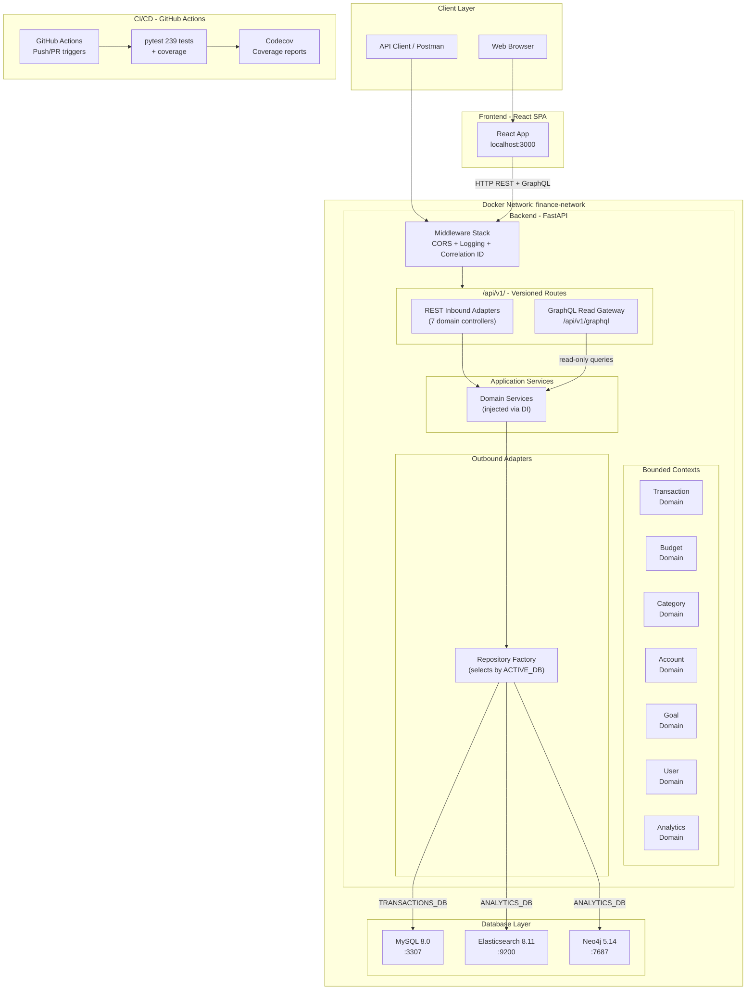
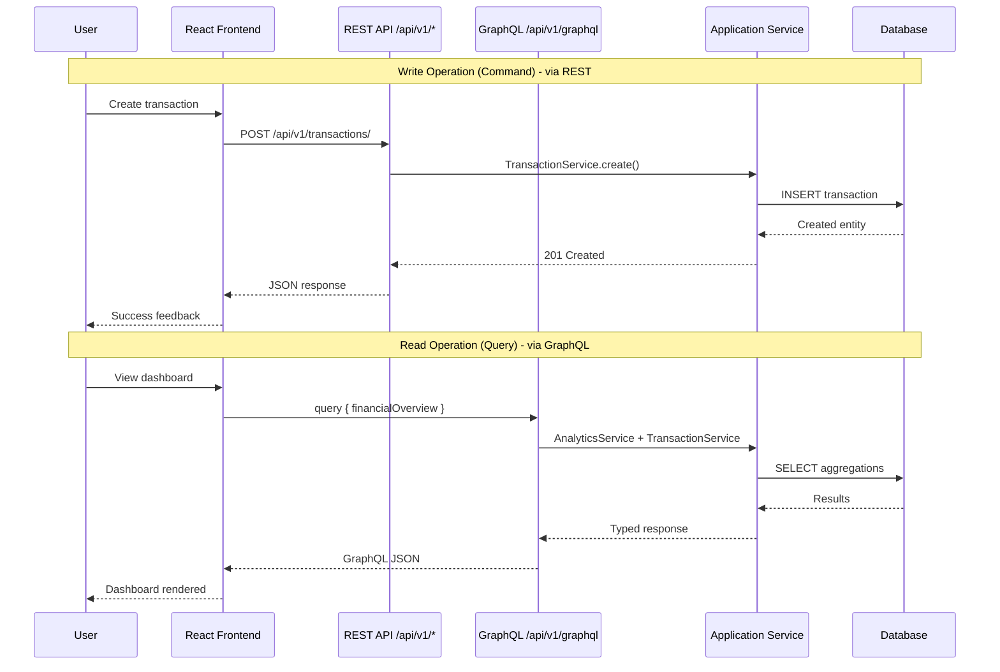
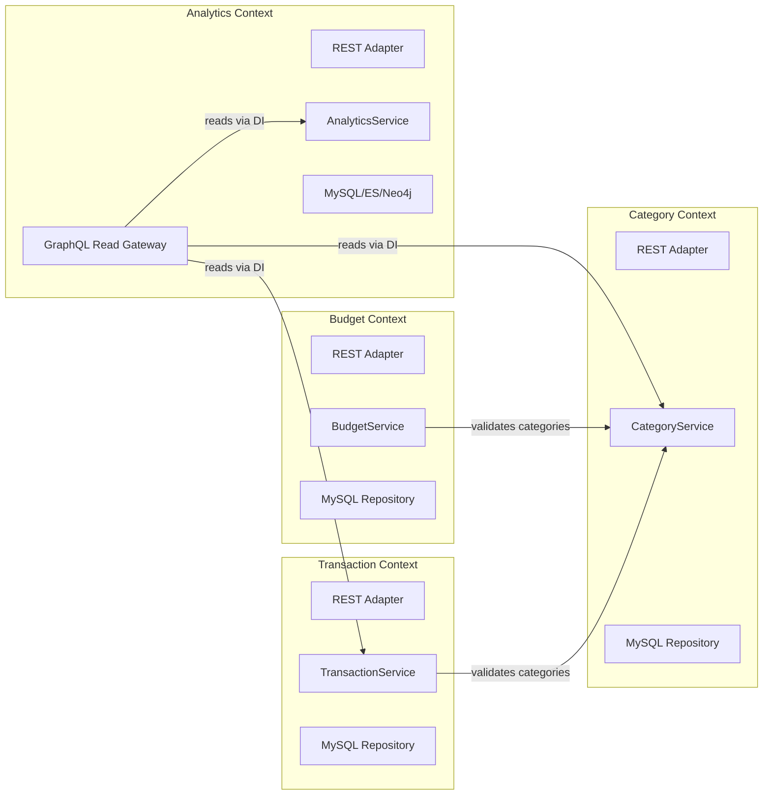
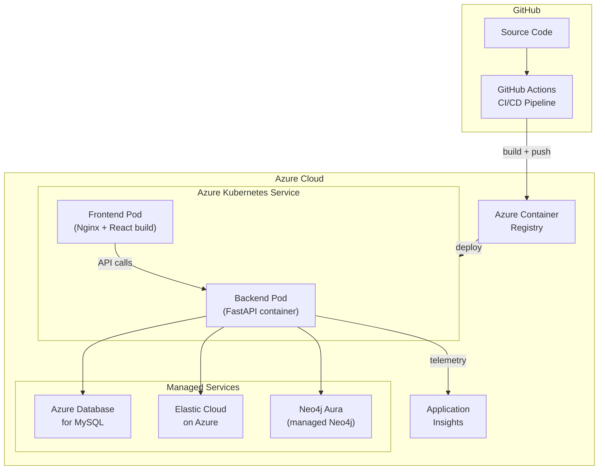
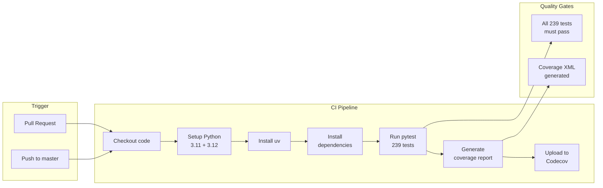
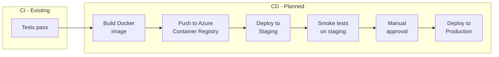
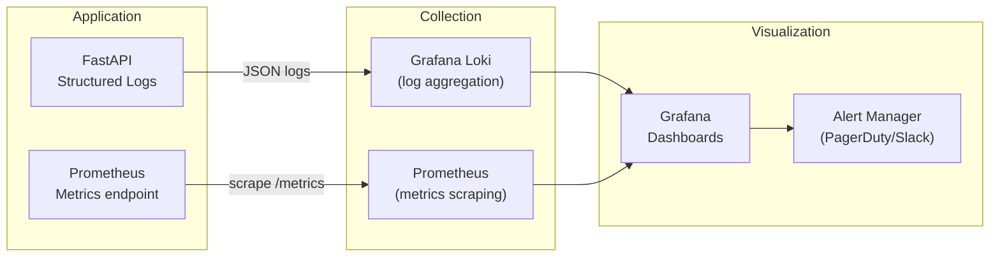

# Mandatory Assignment 1 -- Finance Tracker

**Course:** Development of Large Systems
**Repository:** [github.com/Jothom2912/Finance-Tracker](https://github.com/Jothom2912/Finance-Tracker)

---

## Table of Contents

1. [Project Overview](#1-project-overview)
2. [System Requirements](#2-system-requirements)
3. [Project Management Strategy](#3-project-management-strategy)
4. [Technology Stack](#4-technology-stack)
5. [System Architecture Design](#5-system-architecture-design)
6. [Communication Channels](#6-communication-channels)
7. [Architectural Patterns](#7-architectural-patterns)
8. [Deployment Strategy](#8-deployment-strategy)
9. [CI/CD Pipeline](#9-cicd-pipeline)
10. [Testing Strategy](#10-testing-strategy)
11. [Logging and Monitoring](#11-logging-and-monitoring)
12. [Documentation Strategy](#12-documentation-strategy)
13. [Versioning Strategy](#13-versioning-strategy)
14. [Team Responsibilities](#14-team-responsibilities)

---

## 1. Project Overview

Finance Tracker is a personal finance management application that allows users to track income, expenses, budgets, and savings goals. The system is designed as a modular monolith with hexagonal architecture, prepared for future microservice extraction.

The project demonstrates multi-database support by implementing the same business logic across three different databases (MySQL, Elasticsearch, Neo4j), allowing runtime switching without code changes.

---

## 2. System Requirements

### 2.1 Functional Requirements

| ID | Requirement | Status |
|----|-------------|--------|
| FR-01 | Users can register with username, email, and password | Implemented |
| FR-02 | Users can log in and receive a JWT token | Implemented |
| FR-03 | Users can create and manage multiple financial accounts | Implemented |
| FR-04 | Users can record income and expense transactions | Implemented |
| FR-05 | Users can bulk import transactions from CSV files | Implemented |
| FR-06 | Users can categorize transactions (auto-categorization from CSV) | Implemented |
| FR-07 | Users can create, update, and delete budget plans per category | Implemented |
| FR-08 | Users can view budget vs. actual spending summaries | Implemented |
| FR-09 | Users can set savings goals with target amounts and deadlines | Implemented |
| FR-10 | Users can view a financial dashboard with income/expense overview | Implemented |
| FR-11 | Users can view monthly expense breakdowns | Implemented |
| FR-12 | Users can query financial data across domains via GraphQL | Implemented |
| FR-13 | Users can create account groups for shared budgets | Implemented |
| FR-14 | Users can schedule planned/recurring transactions | Implemented |
| FR-15 | The system supports switching between MySQL, Elasticsearch, and Neo4j | Implemented |

### 2.2 Non-Functional Requirements

| ID | Requirement | Target | Status |
|----|-------------|--------|--------|
| NFR-01 | API response time under normal load | < 500ms per request | Met (local) |
| NFR-02 | Support concurrent users | 50+ simultaneous users | Designed for (async FastAPI) |
| NFR-03 | Data consistency for financial transactions | ACID compliance (MySQL) | Met |
| NFR-04 | Authentication security | JWT with bcrypt (12 rounds), 24h token expiry | Met |
| NFR-05 | Input validation at API boundary | All endpoints validated via Pydantic | Met |
| NFR-06 | Test coverage | > 80% for business logic | Met (239 tests) |
| NFR-07 | API backward compatibility | Versioned endpoints (/api/v1/) | Met |
| NFR-08 | Request traceability | Correlation ID on every request | Met |
| NFR-09 | Environment-independent configuration | All config via environment variables | Met (12-factor) |
| NFR-10 | Containerized deployment | Docker Compose with health checks | Met |

---

## 3. Project Management Strategy

The project follows a **Kanban-based approach** with the following practices:

- **Board:** GitHub Issues and Projects board for task tracking
- **Work in Progress (WIP) limits:** Maximum 2-3 tasks in progress simultaneously
- **Prioritization:** Tasks prioritized by architectural impact and assignment deadlines
- **Iterations:** Work organized in weekly iterations with review at end of each
- **Version control:** Git with feature branches merged to master via pull requests

Kanban was chosen over Scrum because the team size is small and the project scope was already defined by the course requirements. Kanban provides flexibility to reprioritize without the overhead of sprint planning ceremonies.

---

## 4. Technology Stack

| Layer | Technology | Justification |
|-------|-----------|---------------|
| Backend framework | FastAPI (Python 3.11+) | Async support, automatic OpenAPI docs, dependency injection via `Depends()` |
| Frontend | React 18 | Component-based, large ecosystem, team familiarity |
| Primary database | MySQL 8.0 | ACID compliance, relational queries, mature ecosystem |
| Search/analytics DB | Elasticsearch 8.11 | Full-text search, aggregation pipelines, dashboard analytics |
| Graph database | Neo4j 5.14 | Relationship traversal, graph queries via Cypher |
| Authentication | JWT + bcrypt | Stateless auth suitable for microservice extraction |
| API protocols | REST + GraphQL (Strawberry) | CQRS: REST for writes, GraphQL for cross-domain reads |
| Containerization | Docker + Docker Compose | Reproducible environments, multi-service orchestration |
| CI/CD | GitHub Actions | Free for public repos, integrated with GitHub |
| Package manager | uv (Python), npm (React) | Fast, deterministic dependency resolution |
| ORM | SQLAlchemy | Database abstraction, migration support |
| Validation | Pydantic | Type-safe request/response validation |

---

## 5. System Architecture Design

### 5.1 High-Level System Architecture

The following diagram shows the complete system from a bird's-eye perspective, including all services, databases, networking, and the CI/CD pipeline:



### 5.2 Frontend-Backend Interaction

The frontend communicates with the backend through two protocols:



**Key design decision:** REST handles all write operations (commands), while GraphQL serves as a cross-domain read gateway (queries). This is a deliberate CQRS pattern that separates concerns and allows independent scaling of read and write paths in a future microservice architecture.

### 5.3 Bounded Context Map

Each bounded context is a self-contained hexagonal module:



Cross-context communication happens only through service interfaces injected via FastAPI dependency injection, preserving domain encapsulation.

---

## 6. Communication Channels

### 6.1 External Communication (Client to Backend)

| Channel | Protocol | Use Case | Direction |
|---------|----------|----------|-----------|
| REST API | HTTP/JSON | All write operations (CRUD) | Synchronous request-response |
| GraphQL | HTTP/JSON | Cross-domain read queries | Synchronous request-response |
| Health Check | HTTP | Service availability monitoring | Synchronous |

### 6.2 Internal Communication (Between Bounded Contexts)

| Channel | Mechanism | Use Case |
|---------|-----------|----------|
| Service injection | FastAPI `Depends()` | Cross-domain reads in GraphQL gateway |
| Shared database | SQLAlchemy session | Transactional consistency |

### 6.3 Rationale for Synchronous Communication

All communication is currently synchronous (request-response). This was a deliberate choice for the current scope:

- **Simplicity:** No message broker infrastructure needed
- **Consistency:** Financial transactions require immediate feedback
- **Debugging:** Easier to trace with correlation IDs

**Future evolution:** When extracting microservices, asynchronous communication via a message broker (e.g., RabbitMQ or Apache Kafka) would be introduced for:
- Event-driven updates between services (e.g., "TransactionCreated" event triggers budget recalculation)
- Decoupling services for independent deployment
- Handling eventual consistency across service boundaries

---

## 7. Architectural Patterns

### 7.1 Hexagonal Architecture (Ports & Adapters)

Each bounded context follows the hexagonal architecture pattern:

```
Inbound Adapters (REST/GraphQL)
        ↓
  Inbound Ports (Service interfaces)
        ↓
  Application Services (Business logic)
        ↓
  Outbound Ports (Repository interfaces)
        ↓
Outbound Adapters (MySQL/ES/Neo4j repositories)
```

This ensures that business logic is isolated from infrastructure concerns. The same service can be used with any database by swapping the outbound adapter.

### 7.2 CQRS (Command Query Responsibility Segregation)

- **Commands** (writes): Handled by REST endpoints, each scoped to a single bounded context
- **Queries** (reads): Handled by GraphQL read gateway, capable of aggregating data across multiple contexts

This separation allows independent optimization of read and write paths.

### 7.3 Repository Pattern

Abstract repository interfaces (`base.py`) define the data access contract. Concrete implementations exist for MySQL, Elasticsearch, and Neo4j. A factory function selects the implementation based on environment configuration.

### 7.4 Dependency Injection

FastAPI's `Depends()` mechanism is used for constructor injection of all services and repositories. No service creates its own dependencies -- everything is wired in `dependencies.py`.

---

## 8. Deployment Strategy

### 8.1 Cloud Provider Investigation

| Provider | Compute | Database | Pros | Cons |
|----------|---------|----------|------|------|
| **Azure** | App Service, AKS | Azure Database for MySQL, Cognitive Search | Strong European data residency, good student credits | ES replacement (Cognitive Search) has different API |
| **AWS** | ECS/Fargate, EKS | RDS MySQL, OpenSearch, Neptune | Most mature, widest service selection | Complexity, cost at scale |
| **GCP** | Cloud Run, GKE | Cloud SQL MySQL, Elastic Cloud | Good Kubernetes support, competitive pricing | Smaller ecosystem than AWS |
| **DigitalOcean** | App Platform, Kubernetes | Managed MySQL | Simplest setup, predictable pricing | Limited services (no managed ES/Neo4j) |

### 8.2 Chosen Provider: Azure

**Primary choice: Microsoft Azure** with the following justification:

1. **European data residency:** Azure has data centers in Northern Europe (Denmark region coming), important for GDPR compliance with financial data
2. **Student credits:** Azure for Students provides $100 free credit, sufficient for development and testing
3. **Managed services:** Azure Database for MySQL Flexible Server, Azure Kubernetes Service (AKS), Azure Container Registry
4. **CI/CD integration:** GitHub Actions has native Azure deployment actions
5. **Monitoring:** Azure Monitor + Application Insights provides built-in logging, metrics, and tracing

### 8.3 Planned Deployment Architecture



---

## 9. CI/CD Pipeline

### 9.1 Current Pipeline (Implemented)

The project uses GitHub Actions for continuous integration. The pipeline runs on every push and pull request to the master branch.



**Pipeline configuration:** [`.github/workflows/ci.yml`](.github/workflows/ci.yml)

- **Matrix testing:** Tests run against Python 3.11 and 3.12
- **Environment:** `ACTIVE_DB=mysql`, `SECRET_KEY=test-secret-key-for-ci`
- **Coverage:** Reports uploaded to Codecov
- **Pre-push hook:** Local git hooks run all 239 tests before push

### 9.2 Planned CD Pipeline (Future)



The CD pipeline is not yet implemented but designed with a staging environment and manual approval gate before production deployment.

### 9.3 Pre-push Git Hook

A local pre-push hook runs the full test suite before allowing pushes to remote:

```bash
# Runs automatically before git push
pytest tests/ -v --tb=short
# Push is rejected if any test fails
```

---

## 10. Testing Strategy

### 10.1 Testing Pyramid

The project follows the testing pyramid with the majority of tests at the unit level:

```
         +----------+
         |   E2E    |   ~5% - Cypress (frontend user flows)
         +----------+
         | Integr.  |   ~19% - 45 tests (full HTTP + GraphQL)
         +----------+
         |   Unit   |   ~81% - 194 tests (services + schema BVA)
         +----------+
```

### 10.2 Test Categories

| Level | Count | Location | What Is Tested | Tools |
|-------|-------|----------|----------------|-------|
| Unit (services) | ~30 | `tests/unittests/services/` | Service business logic with mocked repositories | pytest, unittest.mock |
| Unit (schemas) | ~164 | `tests/unittests/test_*.py` | Pydantic schema boundary value analysis (BVA) | pytest |
| Integration | 32 | `tests/integration/test_*_flow.py` | Full HTTP request-response with in-memory SQLite | pytest, TestClient |
| Integration (GraphQL) | 13 | `tests/integration/test_graphql_flow.py` | GraphQL queries, schema validation, correlation ID | pytest, TestClient |
| E2E | 2 suites | `cypress/e2e/` | User login flow, CSV upload | Cypress |

### 10.3 Testing Patterns

**Unit tests** use the AAA pattern (Arrange-Act-Assert) with mocked repositories:

```python
class TestTransactionService:
    def setup_method(self):
        self.mock_transaction_repo = Mock(spec=TransactionRepository)
        self.mock_category_repo = Mock(spec=CategoryRepository)
        self.service = TransactionService(
            transaction_repo=self.mock_transaction_repo,
            category_repo=self.mock_category_repo,
        )

    def test_create_transaction_validates_category(self):
        self.mock_category_repo.get_by_id.return_value = None
        with pytest.raises(ValueError):
            self.service.create_transaction(transaction_data)
```

**Integration tests** use FastAPI TestClient with in-memory SQLite, testing the full HTTP stack including authentication, serialization, and database persistence.

**GraphQL schema validation tests** verify that the GraphQL endpoint returns precise error messages for invalid queries, demonstrating a concrete advantage over REST: clients get field-level validation without custom error-handling code.

### 10.4 CI Integration

All 239 tests run in the GitHub Actions CI pipeline on every push and pull request. The pipeline tests against both Python 3.11 and 3.12 to ensure compatibility. Coverage reports are generated and uploaded to Codecov.

Tests must pass before code can be pushed (enforced by pre-push git hook) and before pull requests can be merged.

---

## 11. Logging and Monitoring

### 11.1 Current Implementation: Structured Logging

The backend implements structured logging with the following features:

| Feature | Implementation | Purpose |
|---------|---------------|---------|
| Correlation ID | Auto-generated UUID per request | End-to-end request tracing |
| Request logging | Method, path, status, duration_ms | Performance monitoring |
| Dual format | Human-readable (dev) / JSON (prod) | Developer experience vs. machine parsing |
| Log levels | Configurable via `LOG_LEVEL` env var | Filter verbosity per environment |
| Response header | `X-Correlation-ID` returned to client | Client-side debugging and support tickets |

**Log output example (production JSON format):**

```json
{
  "correlation_id": "a1b2c3d4-e5f6-7890-abcd-ef1234567890",
  "method": "POST",
  "path": "/api/v1/transactions/",
  "status": 201,
  "duration_ms": 45.2
}
```

### 11.2 Planned Production Monitoring Stack

For production deployment, the following monitoring stack is planned:



**Planned metrics to monitor:**

| Metric | Type | Alert Threshold |
|--------|------|-----------------|
| Request latency (p95) | Histogram | > 500ms |
| Error rate (5xx) | Counter | > 1% of requests |
| Database connection pool | Gauge | > 80% utilization |
| Active requests | Gauge | > 100 concurrent |
| JWT authentication failures | Counter | > 10 per minute (brute force) |

**Azure-specific:** When deployed to Azure, Application Insights would replace the Prometheus/Grafana stack, providing built-in distributed tracing, performance monitoring, and alerting with minimal configuration.

---

## 12. Documentation Strategy

### 12.1 Documentation Locations

| Type | Location | Audience |
|------|----------|----------|
| Project overview | `README.md` (root) | New developers, evaluators |
| Installation guide | `INSTALLATION.md` | Developers setting up locally |
| Backend architecture | `backend/README.md` | Backend developers |
| Structure map | `backend/docs/STRUCTURE.md` | Architecture reference |
| Database comparison | `backend/DATABASE_COMPARISON.md` | Database selection decisions |
| Repository pattern | `backend/repositories/README.md` | Data layer developers |
| API documentation | Auto-generated at `/docs` | API consumers |
| GraphQL schema | Auto-generated at `/api/v1/graphql` | GraphQL consumers |
| Assignment report | `docs/MANDATORY_ASSIGNMENT_1_REPORT.md` | Course evaluation |

### 12.2 Documentation Principles

1. **Code as documentation:** Type hints, Pydantic schemas, and docstrings serve as living documentation
2. **Architecture Decision Records:** Key decisions (CQRS, hexagonal, database selection) documented in context
3. **Auto-generated API docs:** FastAPI generates OpenAPI/Swagger UI automatically -- no manual API documentation needed
4. **Diagrams in code:** All architecture diagrams use Mermaid in markdown files, keeping them version-controlled and up-to-date

---

## 13. Versioning Strategy

### 13.1 API Versioning

**Strategy:** URL path prefix versioning

All domain routes are versioned under `/api/v1/`. Infrastructure endpoints (`/health`, `/`) remain unversioned.

| Endpoint | Version | Example |
|----------|---------|---------|
| Domain routes | `/api/v1/*` | `POST /api/v1/transactions/` |
| GraphQL | `/api/v1/graphql` | GraphQL queries |
| Health check | `/health` (unversioned) | `GET /health` |

**Breaking change policy:** When a breaking change is needed, a new version (`/api/v2/`) is introduced while `/api/v1/` remains available for backward compatibility during a deprecation period.

### 13.2 Database Versioning

**Current state:** Database schema is managed by SQLAlchemy's `create_all()` which creates tables on startup. Manual migration scripts exist in `backend/migrations/`.

**Planned evolution:** Alembic (SQLAlchemy's migration tool) for:
- Versioned migration files with up/down operations
- Schema change tracking in version control
- Automated migration in CI/CD pipeline
- Rollback capability for failed deployments

### 13.3 Code Versioning

**Branching strategy:** Trunk-based development with feature branches

```
master (main branch - always deployable)
  ├── feature/graphql-gateway (merged via PR)
  ├── feature/api-versioning (merged via PR)
  └── fix/budget-summary-route (merged via PR)
```

- **master:** Protected branch, always in a deployable state
- **Feature branches:** Short-lived branches for new features, merged via pull request
- **Pre-push hooks:** All tests must pass before push is allowed
- **Semantic commits:** Descriptive commit messages following imperative mood ("Add feature", "Fix bug")

---

## 14. Team Responsibilities

| Area | Responsibility | Description |
|------|---------------|-------------|
| Backend architecture | Backend lead | Hexagonal architecture, CQRS, service design |
| Database layer | Database lead | Multi-database support, repository implementations, migrations |
| Frontend | Frontend lead | React components, API integration, UI/UX |
| DevOps | Infrastructure lead | Docker, CI/CD, deployment configuration |
| Testing | QA lead | Test strategy, test implementation, coverage |
| Documentation | Shared | All team members document their own work |

Note: In small teams, one person may cover multiple areas. The key principle is that each area has a clearly identified owner.
